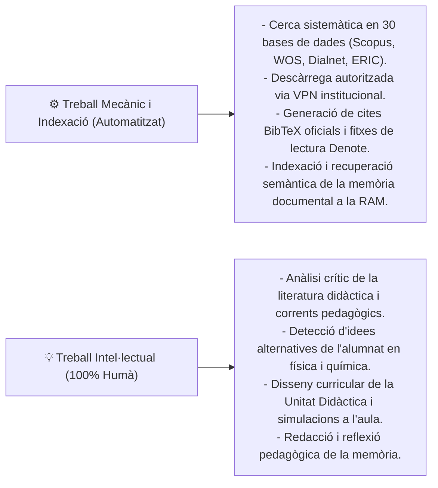
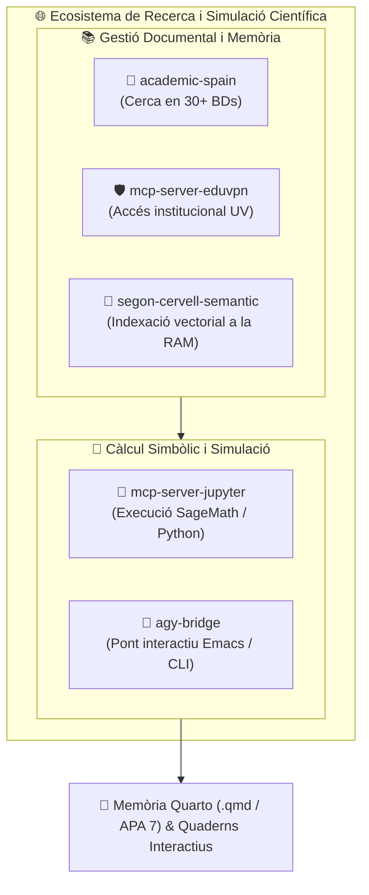

# 🎓 Implementació del Pensament Computacional a Secundària mitjançant Quaderns Interactius de Jupyter i SageMath

> **Treball de Final de Màster (TFM)**  
> *Màster Universitari en Professorat d'Educació Secundària (Especialitat Física i Química)*  
> **Universitat de València (UV)** — Curs 2025/2026  
> **Autor:** Casimir Victòria  

---

## 🎯 Objectiu del Treball

Aquest projecte investiga i desenvolupa una proposta didàctica innovadora sobre com l'ús del **Pensament Computacional (PC)** i la modelització científica interactiva poden transformar l'ensenyament-aprenentatge de la **Física i la Química** a l'Educació Secundària Obligatòria (ESO) i al Batxillerat, d'acord amb el marc curricular de la **LOMLOE** i el **Decret 107/2022 de la Generalitat Valenciana**.

Per a portar a terme aquesta implementació a l'aula, s'utilitzen **quaderns interactius de Jupyter** combinats amb el sistema de computació matemàtica i científica de codi obert **SageMath** (basat en Python).

---

## 🧠 Reflexió Metodològica: Predicar amb l'Exemple del Pensament Computacional

En el desenvolupament d'aquest TFM s'ha aplicat un principi fonamental: **com a futurs docents de ciències, no podem promoure el pensament computacional a l'aula si no som capaços d'aplicar-lo amb rigor a la nostra pròpia feina de recerca**.

Per aquest motiu, la metodologia de recerca d'aquest treball estableix una divisió clara i transparent:

1. **Automatització de les tasques mecàniques i gestió de la memòria:** Les tasques repetitives (cerca documental simultània, extracció de metadades editorials, formatat de citacions en APA 7 i indexació semàntica per a la recuperació instantània de fitxes de lectura a la memòria RAM) s'han automatitzat mitjançant el desenvolupament d'eines pròpies de codi obert ([`mcp-server-academic-spain`](https://github.com/CasimirVictoria/mcp-server-academic-spain) i [`mcp-server-segon-cervell-semantic`](https://github.com/CasimirVictoria/segon-cervell-semantic-mcp)). Això assegura una revisió sistemàtica exhaustiva sense biaixos d'omissió ni pèrdua de referències.
2. **Centralitat del treball intel·lectual docent:** Alliberar el temps de les tasques burocràtiques i mecàniques permet dedicar el 100% de l'esforç a la reflexió pedagògica, a la transposició didàctica dels conceptes científics i al disseny d'activitats d'indagació autèntiques per a l'alumnat.

---

## 🌐 Un Aprenentatge Integrat: La Confluència de Quatre Àmbits

L'elaboració d'aquest Treball de Final de Màster ha suposat un procés d'aprenentatge especialment enriquidor: l'oportunitat d'explorar la confluència de **quatre àmbits que sovint es treballen per separat**, però que s'han anat entrellaçant de manera natural al llarg del projecte:

1. 🧪 **La Didàctica de les Ciències Experimentals:** Com a eix central, cercant maneres d'acostar la Física i la Química a l'alumnat a partir de la indagació i la comprensió dels fenòmens naturals.
2. 💻 **El Pensament Computacional:** Entès com una eina d'aprenentatge pràctica mitjançant entorns interactius lliures (`Jupyter`, `SageMath`, `Python`) per a visualitzar i experimentar amb models científics a l'aula.
3. 🧠 **L'Organització del Treball i la Memòria:** L'ús de mètodes d'indexació i gestió de notes en text pla (`Denote`, `Emacs`) per a estructurar les pròpies lectures i la recerca bibliogràfica amb rigor.
4. 🛡️ **El Compromís amb el Programari Lliure:** La decisió de fonamentar tota la proposta en tecnologies obertes i accessibles (Linux, Git, Quarto), assegurant que qualsevol docent i centre públic puga utilitzar i adaptar aquests recursos lliurement.

Aquest camí ha permès enfocar el TFM no sols com un tràmit acadèmic, sinó com una **experiència formativa molt valuosa per a consolidar una visió docent coherent, pràctica i compromesa amb l'escola pública**.

## 🧩 L'Ecosistema d'Eines Pròpies: MCPs i `agy-bridge`

Per tal de donar suport pràctic a la proposta metodològica i garantir un flux de treball autònom, reproduïble i basat en estàndards oberts, s'han desenvolupat i integrat diverses eines modulars sota el protocol obert **Model Context Protocol (MCP)** i un pont d'execució interactiva:

### 1. La Suite de Servidors MCP Sobiranitzats:
* 🔎 **[`mcp-server-academic-spain`](https://github.com/CasimirVictoria/mcp-server-academic-spain):** Motor unificat de cerca acadèmica que connecta amb més de 30 repositoris espanyols i internacionals (Dialnet, ERIC, Scopus, WOS, OpenAlex, Eureka, etc.), extraient metadades i citacions BibTeX automàticament.
* 🛡️ **[`mcp-server-eduvpn`](https://github.com/CasimirVictoria/mcp-server-eduvpn):** Mòdul de connexió autònoma a la xarxa privada de la Universitat de València (`eduVPN`), que permet l'accés legítim als articles i llibres científics subscrits per la biblioteca universitària.
* 🧠 **[`mcp-server-segon-cervell-semantic`](https://github.com/CasimirVictoria/segon-cervell-semantic-mcp):** Servidor d'indexació vectorial ultraràpid (`FastEmbed` + `SQLite WAL`) que cerca per afinitat semàntica a través de les fitxes de lectura de Denote a la memòria RAM (< 3 ms), facilitant la recuperació d'idees sense interferir en la redacció.
* 🧮 **[`mcp-server-jupyter`](https://github.com/CasimirVictoria/mcp-server-jupyter):** Servidor d'execució remota de codi que es comunica amb els nuclis de càlcul de Jupyter (`sagemath`, `python3`, `ir`) per a validar expressions matemàtiques i derivacions físiques en temps real.

### 2. `agy-bridge`: El Pont Interactiu per a Simulacions i Càlculs Simbòlics
* 🌉 **[`agy-bridge`](https://github.com/CasimirVictoria/agy-bridge):** És una passarel·la lleugera i bidireccional desenvolupada per a interconnectar l'editor de text ([GNU Emacs](https://www.gnu.org/software/emacs/)), la línia d'ordres i els servidors de càlcul.
* **Com s'empra per a la modelització interactiva:** `agy-bridge` permet enviar directament blocs de càlcul simbòlic de **SageMath** des dels fitxers font cap a l'entorn d'execució de Jupyter, capturar a l'instant els resultats analítics (arrels d'equacions, derivades, integrals) i generar visualitzacions interactives (`parametric_plot`, `plot3d`, `@interact`) que es renderitzen de manera immediata a la pantalla del docent o investigador.

Aquest ecosistema modular demostra com la combinació d'estàndards oberts permet crear un entorn de treball científic i pedagògic d'alt nivell, completament sobirà, privat i exempt de dependències comercials privatives.

---

## 🛠️ Ecosistema Tecnològic i Ciència Oberta (REA)

Tot el projecte està construït sobre tecnologies lliures, gratuïtes i de text pla, garantint que qualsevol docent o centre educatiu puga auditar, replicar i adaptar el material lliurement:

* **Format:** [Quarto Markdown](https://quarto.org/) (`.qmd`) per a generació reproducible de la memòria en PDF, HTML i LaTeX seguint les normes **APA 7**.
* **Càlcul i Simulació:** [SageMath](https://www.sagemath.org/) (versió 10.10 compilada des del codi font) i [JupyterLab](https://jupyter.org/).
* **Editor i Gestió del Coneixement:** [GNU Emacs](https://www.gnu.org/software/emacs/) amb integració de [Citar](https://github.com/emacs-citar/citar), [Denote](https://protesilaos.com/emacs/denote) i [citar-denote](https://github.com/pprevos/citar-denote) per a fitxes de lectura interconnectades.
* **Control de Versions:** [Git](https://git-scm.com/) i [GitHub](https://github.com/CasimirVictoria/TFM-Secundaria_FiQ_PC_Jupyter_Sagemath).
* **Bases de Dades Consultades:** Scopus, Web of Science (Clarivate), Dialnet, OpenAlex, ERIC, Revista Eureka, RODERIC (Universitat de València), RIUNET, RUA, UJI, SciELO, Redalyc, TESEO, TDR, arXiv i CORE.

---

## 📜 Llicència i Compromís amb el Programari Lliure

Aquest projecte s'allibera sota la llicència de domini públic **Creative Commons Zero 1.0 (CC0 1.0)**, alineant-se amb la filosofia dels **Recursos Educatius Oberts (REA)** i de la **Ciència Oberta (Open Science)** impulsada per la UNESCO i les universitats públiques.
