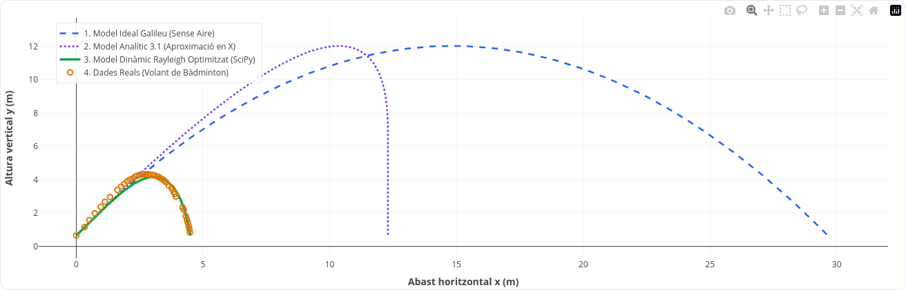
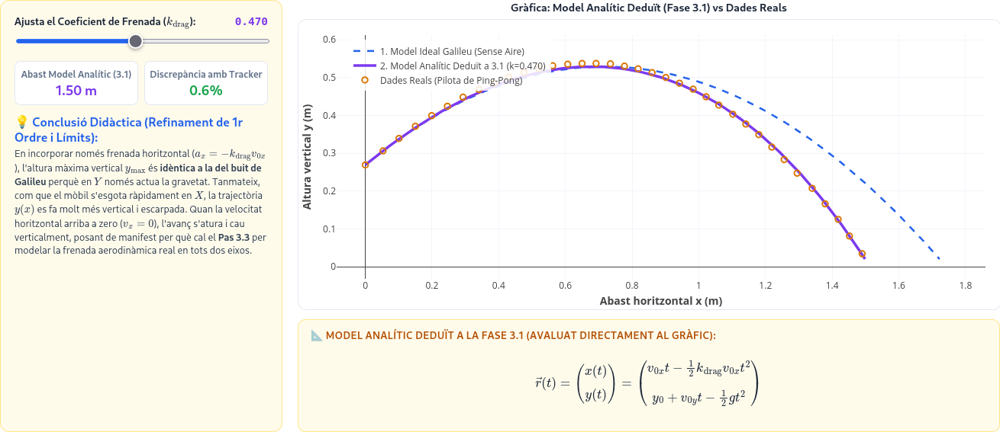
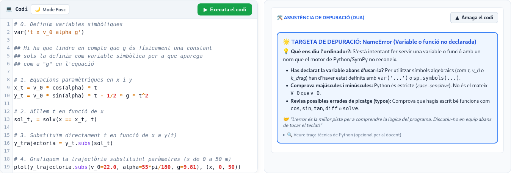

## Pensament Computacional i Modelització en Física de Batxillerat {.title-slide-manual}

::: {.title-content-box}
[Proposta d'Innovació Didàctica]{.manual-subtitle}

**Casimiro Victoria Castillo**  
*Màster en Professor/a d'Educació Secundària*
:::

::: {.notes}
**PORTADA / ENFOCAMENT METODOLÒGIC (20-25 segons)**

"Bona vesprada. Abans de res, vull situar l'abast metodològic d'aquest treball: és una Proposta d'Innovació Didàctica concebuda des del marc de la Investigació Basada en el Disseny Educatiu. El TFM culmina la seua Fase 1 —anàlisi del problema, disseny instruccional i desenvolupament de prototips d'aula—, i les preguntes sobre càrrega cognitiva i motivació queden formulades com a hipòtesis de disseny per a la futura implementació empírica als centres. Partint d'aquesta delimitació, vegem el diagnòstic del problema…"
:::

---

## 1. Context i Diagnòstic del Problema {data-timing="40"}

### La desafecció STEM i la «reducció algorítmica»

* **Pèrdua continuada de vocacions:** Diagnòstic contrastat per la recerca internacional i del grup de didàctica de la UV (Rocard, 2007; Solbes et al., 2007, 2018).
* **La percepció de l'alumnat:** Abús de càlcul manual de «llapis i paper», aprenentatge mecànic de fórmules sense comprensió física profunda.
* **Evidència directa al Pràcticum:** Constatació de l'apatia en tractar cinemàtica (MRU/MRUA) desconnectada del món real i de l'experiència quotidiana.

::: {.notes}
**Temps: 0:00 - 0:40 (40 segons)**
"Es parteix d'un diagnòstic àmpliament contrastat per la recerca en didàctica de les ciències, especialment pels treballs del departament de la nostra universitat: la desafecció progressiva cap a la Física i les carreres STEM.
L'alumnat de Secundària i Batxillerat manifesta sovint que la Física es redueix a un exercici repetitiu de llapis i paper: aplicar fórmules apreses de memòria i aïllar incògnites algebraiques sense entendre el comportament de la natura. Això mateix vaig poder constatar directament durant l'estada de Pràcticum a les aules de Batxillerat."
:::

---

## 2. La Resposta: De la «Caixa Negra» a la «Caixa Blanca» {data-timing="40"}

### El pensament computacional com a eina epistèmica

* **El límit de la «Caixa Negra»:** Els simuladors tancats i fulls de càlcul sovint oculten la matemàtica subjacent (prémer botons sense construir el model).
* **La «Caixa Blanca» Cognitiva:** Eines de codi obert (*SageMath* en *JupyterLab*) que permeten a l'alumnat inspeccionar, auditar i modificar les lleis físiques (Hanc, 2020).
* **Alliberament cognitiu:** Automatitzar el càlcul algebraic manual i repetitiu per a alliberar memòria de treball i concentrar l'atenció en la interpretació física, les hipòtesis i els casos límit.

::: {.notes}
**Temps: 0:40 - 1:20 (40 segons)**
"Com donem resposta a aquesta situació? Aquesta proposta consisteix a introduir el pensament computacional com una eina epistèmica per a construir ciència, i no pas com una simple novetat tecnològica.
Superem la 'caixa negra' dels simuladors tancats on l'alumnat és un simple consumidor passiu que prem botons, i apostem per la 'caixa blanca' mitjançant eines de codi obert: l'estudiant pot auditar el codi, modificar les forces i entendre el model. 
Això produeix un alliberament cognitiu real: en descarregar la fatiga del càlcul mecànic a l'ordinador, l'esforç intel·lectual se centra en allò que és autènticament físic."
:::

---

## 3. Marc Teòric i Bastida Pedagògica {data-timing="70"}

### Com s'aprèn Física programant?

::: {.columns}
::: {.column width="45%"}
#### Eina Epistèmica (Papert / Wing)
* L'ordinador com a *«object to think with»*.
* Declarar equacions en codi obliga a explicitar variables, causes i condicions de contorn (Weintrop et al., 2016).
* **Cicle de Modelització d'Hestenes (1987):** Formulació $\to$ Desenvolupament $\to$ Contrast.
:::

::: {.column width="55%"}
#### Bastida *Use-Modify-Create* (Grover & Pea)

| Fase UMC | Nivell Herron | Acció de l'Alumnat a l'Aula |
| :--- | :--- | :--- |
| **USE** | Nivell 1 | Executa simulacions interactives (`@interact`) dissenyades pel docent. |
| **MODIFY** | Nivell 2 | Modifica paràmetres físics i equacions sobre **Codi Esquelet (*Skeleton Code*)**. |
| **CREATE** | Nivell 3 | Construeix un assaig computacional de contrast teòric-empíric. |

* **Prevenció de la «utopia cognitiva»:** L'alumnat de Batxillerat mai s'enfronta a una pantalla buida de codi des de zero.
:::
:::

::: {.notes}
**Temps: 1:20 - 2:20 (1 minut)**
"Com s'organitza pedagògicament aquesta integració a l'aula? Per a evitar el que la literatura anomena la 'utopia cognitiva' —demanar a estudiants sense base de programació que programen des del buit—, s'adopta de manera rigorosa la bastida Use-Modify-Create de Grover i Pea, enllaçada amb els nivells d'indagació d'Herron i el cicle de modelització d'Hestenes. L'alumnat parteix sempre d'un Codi Esquelet dissenyat pel professor: primer usa i explora qualitativament, després modifica paràmetres físics i condicions de contorn, i finalment crea narratives i gràfics de contrast."
:::

---

## 4. Disseny de la SdA: «Més enllà del buit» {data-timing="80"}

### Marc Curricular i Arquitectura Didàctica

::: {.columns}
::: {.column width="50%"}
#### Marc LOMLOE (Decret 108/2022)
* **Destinataris:** 1r de Batxillerat (Física i Química).
* **Sabers bàsics:** Blocs D (*Cinemàtica*) i E (*Estàtica i dinàmica*), vertebrats pel Bloc A (*Treball científic*).
* **Alineament integral:** Desenvolupa directament les **6 Competències Específiques (CE1 a CE6)**.
* **Temporització planificada:** Seqüència nuclear de **6 sessions** (amb flexibilitat d'ampliació a 10-12 sessions segons context).
:::

::: {.column width="50%"}
#### El Conflicte Cognitiu Central
* **Model Clàssic Ideal:** Paràbola de Galileu (buit pur, fregament nul).
* **Realitat Empírica:** Dades reals obtingudes al pati de l'institut mitjançant vídeo-anàlisi amb **Physics Tracker**.
* **Model Dinàmic Realista:** Inclusió de forces de resistència aerodinàmica oposades a la velocitat ($\vec{F}_{\text{freg}}$).
:::
:::

::: {.notes}
**Temps: 2:20 - 3:30 (1 min 10 s)**
"Aquesta proposta es concreta en el disseny complet d'una Situació d'Aprenentatge titulada 'Més enllà del buit', alineada amb el Decret 108/2022 del currículum valencià. Articula els sabers bàsics dels blocs D de Cinemàtica i E d'Estàtica i dinàmica a través de les destreses del bloc A de Treball científic, mobilitzant de manera integral les sis Competències Específiques de la matèria. 
L'eix vertebrador és la generació d'un conflicte cognitiu genuí: s'enfronta el model ideal de Galileu en el buit amb les dades experimentals que els mateixos alumnes enregistren al pati de l'institut mitjançant Physics Tracker. A partir de la discrepància evident entre la teoria de llapis i paper i els fets empírics, l'alumnat sent la necessitat de reconstruir el model."
:::

---

## 5. Nucli Físic: Fases 1 i 2 (Ideal vs Empíric) {data-timing="45"}

### Del model teòric de Galileu al col·lapse empíric

::: {.columns}
::: {.column width="50%"}
#### Fase 1: USE / Model Ideal
* **Concepte:** Lleis de Newton en el buit:
  $$\sum \vec{F} = m\vec{g} \implies a_x=0, \; a_y=-g$$
* **SageMath:** Declaració de variables simbòliques, deducció d'$y(x)$ i renderització formal de les equacions.
* **Física:** Domini de la notació vectorial i càlcul de l'abast teòric màxim.
:::

::: {.column width="50%"}
#### Fase 2: MODIFY / Contrast
* **Concepte:** Límits de validesa dels models científics (CE6).
* **Tracker:** Importació de dades reals.
* **Discrepància empírica contrastada:**
  * Pilota de cautxú: error $\approx 3\%$ (model vàlid).
  * Volant de bàdminton: error $> 500\%$ (**col·lapse absolut del model ideal**).
:::
:::

::: {.notes}
**Temps: 3:30 - 4:15 (45 segons)**
"Vegem què aprèn de Física l'alumnat activitat per activitat:
A la Fase 1, formalitzen la segona llei de Newton vectorialment. L'ordinador fa la substitució algebraica d'aïllar el temps t per a obtindre l'equació de la trajectòria y(x), però l'alumnat ha de definir correctament les condicions inicials.
A la Fase 2, arriba una lliçó epistemològica fonamental: cap model és absolutament cert o fals; tots tenen un rang de validesa. Mentre que la pilota de cautxú s'ajusta a Galileu amb només un 3% d'error, en el volant de bàdminton la discrepància supera el 500%, evidenciant la necessitat d'un nou model."
:::

---

## 6. Nucli Físic: Fase 3 (Models de Fregament i Límits) {data-timing="45"}

### Reconstrucció del model: d'aproximacions a Rayleigh

::: {.columns}
::: {.column width="46%"}
#### Fase 3.1: Frenada en X i Didàctica $y(x)$
* **Aproximació accessible a Batxillerat:**
  $$a_x = -k_{\text{drag}} v_{0x}, \quad a_y = -g$$
* **Didàctica espacial $y(x)$ vs $y(t)$:**
  * En $Y$ només actua la gravetat ($y_{\max}$ idèntic al buit).
  * La pèrdua ràpida de velocitat en $X$ escarpa la corba fins a la caiguda vertical quan $v_x = 0$.

#### Fase 3.3: Model Qualitatiu de Rayleigh
* **Refinament del model:** $\sum \vec{F} = m\vec{g} - c|\vec{v}|\vec{v}$.
* Mostra com la ciència construeix models més precisos per a situacions límit (bàdminton).
:::

::: {.column width="54%"}
{fig-align="center" width="100%" style="border-radius: 8px; box-shadow: 0 4px 12px rgba(0,0,0,0.15); margin-top: 15px;"}
:::
:::

::: {.notes}
**Temps: 4:15 - 5:00 (45 segons)**
"A la Fase 3 reconstruïm la dinàmica. Per a fer-ho matemàticament viable a primer de Batxillerat sense càlcul diferencial avançat, plantegem una aproximació analítica accessible amb frenada en l'eix X.
Això ens permet treballar un aprenentatge conceptual clau: distingir la trajectòria espacial y(x) de les gràfiques temporals y(t). Com que en Y només actua la gravetat, el sostre i el temps de vol són idèntics als del buit, però com que el mòbil perd velocitat en X, la corba es fa molt més escarpada fins a caure en picat quan vx s'anul·la.
Finalment, el model dinàmic de Rayleigh s'introdueix de manera exclusivament qualitativa: serveix per a mostrar a l'alumnat com la ciència elabora models més refinats que responen amb precisió a situacions límit, observant visualment a la simulació com la corba reprodueix fidelment el vol del bàdminton."
:::

---

## 7. Viabilitat Cognitiva a Batxillerat {data-timing="60"}

### Adaptació estricta al nivell maduratiu de l'etapa

::: {.columns}
::: {.column width="45%"}
#### Com s'avalua la bondat del model:
* **Visualment:** Contrast directe a les gràfiques interactives de la SdA.
* **Numèricament (Error Relatiu de l'Abast):**
  $$\varepsilon_r = \left| \frac{X_{\text{simulat}} - X_{\text{experimental}}}{X_{\text{experimental}}} \right| \times 100$$
* **Sentit de la mesura:** Contingut prescriptiu de 1r de Batxillerat (Bloc A).
* **Interpretació física:** L'alumnat avalua la precisió amb metres reals i percentatges concrets (p. ex. $0.6\%$).
:::

::: {.column width="55%"}
{fig-align="center" width="100%" style="border-radius: 8px; box-shadow: 0 4px 12px rgba(0,0,0,0.15); margin-top: 10px;"}
:::
:::

::: {.notes}
**Temps: 5:00 - 6:00 (1 minut)**
"Un aspecte fonamental en les decisions de disseny ha sigut garantir la viabilitat cognitiva de la proposta a primer de Batxillerat. Per a evitar sobrecàrregues innecessàries, la bondat del model s'avalua de forma molt directa: visualment a través de les gràfiques de contrast i numèricament mitjançant l'error relatiu de l'abast. D'aquesta manera, l'alumnat connecta amb el contingut curricular del 'Sentit de la mesura' amb una eina intuïtiva, rigorosa i adaptada a la seua etapa."
:::

---

## 8. Inclusió DUA i Treball Cooperatiu {data-timing="70"}

### Orquestració d'aula amb el Programa CA/AC (P. Pujolàs)

::: {.columns}
::: {.column width="55%"}
#### Estructura «Llapissos al centre / Mans fora del teclat»
* **El risc a l'aula d'informàtica:** Que l'alumne amb major competència digital monopolitze el teclat i aïlle la resta.
* **La intervenció metodològica:**
  1. Es planteja el repte físic o l'algorisme.
  2. Mans fora del teclat: discussió, consens verbal i disseny físic en equip.
  3. Només amb acord unànime, el rol actiu escriu el codi al quadern Jupyter.
:::

::: {.column width="45%"}
#### Pautes DUA (CAST, 2024)
* **Compromís (Pauta 8.3):** Foment de la col·laboració entre iguals en equips heterogenis.
* **Múltiples registres de representació:** Integració en un mateix espai de text explicatiu, formalisme matemàtic, simulació dinàmica i gràfics empírics.
:::
:::

::: {.notes}
**Temps: 6:00 - 7:00 (1 minut)**
"Com evitem que el treball computacional derive en l'aïllament davant de la pantalla o en el monopoli del dispositiu per part de l'estudiant amb més habilitats informàtiques? 
S'aplica el programa cooperatiu 'Cooperar per a aprendre / Aprendre a cooperar' de Pere Pujolàs. En particular, adaptem la dinàmica 'Llapissos al centre' a 'Mans fora del teclat': fins que l'equip no consensua verbalment quin és el balanç de forces o la condició inicial, ningú toca el teclat. Això assegura que la decisió física siga col·lectiva i desplega els principis del Disseny Universal per a l'Aprenentatge, integrant text explicatiu, formalisme matemàtic i dades experimentals."
:::

---

## 9. Dimensió Socioemocional de la Programació {data-timing="70"}

### Transformar l'error: de *Stoppers* a *Movers*

* **La problemàtica afectiva:** La rigidesa de sintaxi genera ansietat tecnològica i frustració destructiva davant missatges d'error críptics (Mellado et al., 2014).

{fig-align="center" width="75%" style="border-radius: 8px; box-shadow: 0 4px 12px rgba(0,0,0,0.15); margin: 6px auto;"}

* **Suport socioemocional (Charles & Gwilliam, 2023):** Targetes de depuració amb pistes amables que redueixen l'ansietat en un $55\%$ i la frustració en un $73\%$, transformant l'error en oportunitat d'aprenentatge.

::: {.notes}
**Temps: 7:00 - 8:00 (1 minut)**
"L'aprenentatge de les ciències té una dimensió afectiva indiscutible. Quan un alumne novell programa per primera vegada i rep un missatge en vermell en anglès com 'SyntaxError: invalid syntax', sovint es bloqueja i abandona.
Inspirant-nos en la recerca de Charles i Gwilliam a la Universitat de Liverpool, s'ha programat un mòdul de suport emocional en valencià integrat directament al nucli de Jupyter. Quan es produeix un error, el sistema ofereix una targeta pedagògica que tradueix l'error a pistes comprensibles. Transformem així l'error d'un element punitiu i bloquejant en una oportunitat metacognitiva d'aprenentatge."
:::

---

## 10. Avaluació Formativa i Reguladora {data-timing="50"}

### La Física al centre: avaluar el modelatge científic, no el codi

::: {.columns}
::: {.column width="45%"}
#### Ponderació Centrada en la Física
* **50% Assaig Físic-Computacional:**
  Comprensió de les lleis de Newton, identificació vectorial de forces, anàlisi de límits de validesa i contrast de discrepàncies.
* **25% Argumentació i Comunicació Científica:**
  Defensa oral del model, justificació física de les corbes i contrast empíric amb el pati.
* **25% Coresponsabilitat i Treball d'Equip:**
  Observació sistemàtica dels rols CA/AC i gestió metacognitiva de l'error.
:::

::: {.column width="55%"}
#### Naturalesa dels Instruments (LOMLOE)
* **La Física és l'únic fi; el codi és el mitjà:** No s'avalua la sintaxi de programació, sinó la capacitat de l'alumnat per a mobilitzar models físics.
* **Aclariment metodològic:** Instruments d'**avaluació formativa i reguladora d'aula** per a guiar l'aprenentatge, no bateries psicomètriques d'impacte en recerca.
* **Rúbrica Analítica Oficial:** 4 nivells d'assoliment vinculats directament als criteris d'avaluació de les Competències Específiques de Física i Química (CE1-CE6, Decret 108/2022).
:::
:::

::: {.notes}
**Temps: 8:00 - 8:50 (50 segons)**
"Pel que fa a l'avaluació, vull subratllar amb total claredat que l'objecte d'avaluació és la Física, mai la destresa informàtica per si mateixa. La programació només és el vehicle que fa visible el raonament científic de l'alumnat.
Per això, l'assaig computacional avalua si han comprés les lleis de Newton, si saben identificar les forces rellevants i si entenen els límits de validesa d'un model. Així mateix, la defensa oral avalua la seua capacitat d'argumentació científica davant de les dades del món real.
Metodològicament, aclarim que aquests instruments són eines d'aula per a regular l'aprenentatge diari i qualificar segons els criteris del Decret 108/2022, i no pas tests psicomètrics de mesura d'impacte científic."
:::

---

## 11. Conclusions, Limitacions i Prospectiva {data-timing="50"}

### Balanç honest d'una investigació basada en el disseny

::: {.columns}
::: {.column width="50%"}
#### Consecució d'Objectius
* **Disseny teòricament fonamentat:** Articulació de la tradició UV (Solbes, Gil-Pérez) amb el càlcul de «caixa blanca».
* **Recursos Educatius Oberts (REA):** Materials distribuïts lliurement a GitHub sota llicència pública **Creative Commons CC0**.
* **Integració del Pràcticum:** Resposta directa a les necessitats reals detectades als centres de secundària.
:::

::: {.column width="50%"}
#### Limitacions i Segon Bucle d'EDR
* **Honestedat metodològica:** El treball es tanca formalment en la seua **fase de disseny i desenvolupament teòric de prototips** (fase 1 d'EDR).
* **Prospectiva investigadora:** La implementació física en una mostra de centres valencians i la mesura empírica de l'impacte en càrrega cognitiva i autoeficàcia constitueixen el **segon bucle d'investigació**.
* **Línia d'innovació futura:** Explorar ponts d'IA oberta per a reduir encara més la barrera d'entrada a la programació científica.
:::
:::

::: {.notes}
**Temps: 8:50 - 9:50 (1 minut)**
"Per concloure, assumim amb absoluta honestedat científica l'abast d'aquest treball. Com a proposta de la Modalitat A emmarcada en la Investigació Basada en el Disseny (EDR), el projecte compleix plenament la seua primera fase: el disseny instruccional i el desenvolupament de prototips teòricament fonamentats. 
L'avaluació empírica de l'impacte real sobre la càrrega cognitiva i la motivació de l'alumnat requerirà la implementació a l'aula en una mostra de centres públics, la qual cosa constitueix formalment el segon bucle d'investigació i la línia de prospectiva natural derivada d'aquesta memòria.
Tots els materials estan publicats en obert a GitHub com a REA en domini públic. Moltes gràcies, quede a la disposició dels membres del tribunal."
:::
