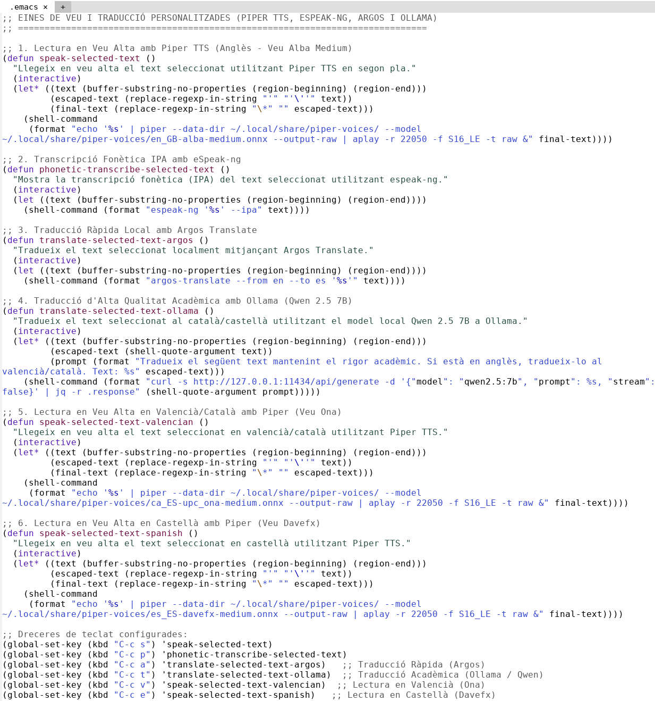
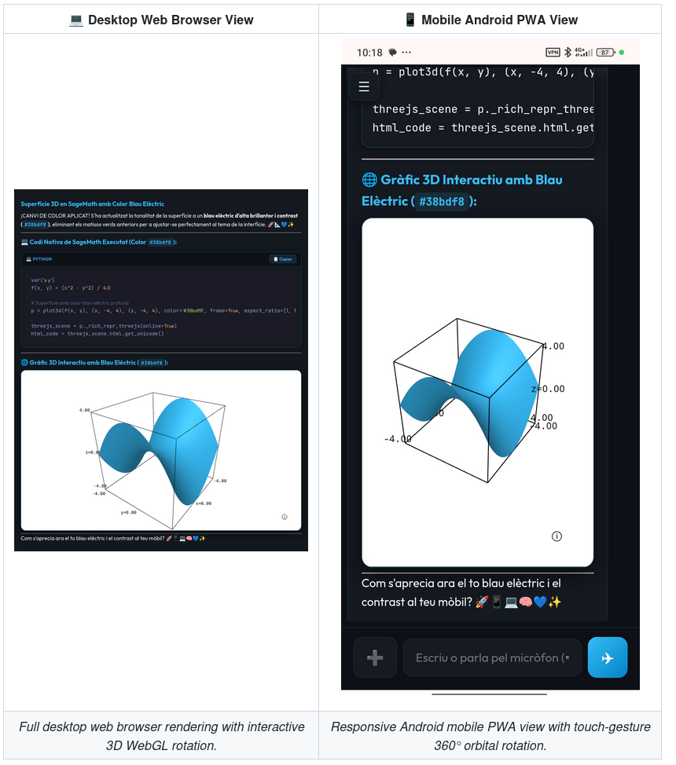

# Eines i Entorn de Treball

## Format
Per a realitzar tot el material emprat en el TFM, així com la mateixa memòria del treball, he emprat el format Quarto Markdown (que vaig emprar per primera vegada en la part d'estadística, conjuntament amb R, de l'assignatura d'Innovació docent del màster). Els motius per a emprar aquest format són:

* Es tracta d'un format de text pla, el que permet editar tot el material en qualsevol editor i facilita emprar un sistema de control de versions com Git.
* Permet crear quaderns de Jupyter de forma nativa.
* Facilita enormement l'exportació a altres formats, com HTML (i crear al seu torn de manera senzilla pàgines web), **LaTeX**, PDF, DOCX, etc.
* Donat que la memòria del màster ha de seguir les normes APA 7, emprar Quarto facilita molt la tasca de formatar les cites bibliogràfiques i la bibliografia final. Simplement cal afegir una línia en la capçalera del document indicant l'estil desitjat, i Quarto s'encarrega de processar-ho de forma automàtica.

## Editor
El fet que es treballe simplement amb text permet editar el contingut amb qualsevol editor o IDE (RStudio, VSCode, Vim, Emacs...). Jo en particular he decidit desenvolupar i redactar tot el projecte emprant [Emacs](https://www.gnu.org/savannah-checkouts/gnu/emacs/emacs.html), un entorn increïblement personalitzable mitjançant el llenguatge de programació Lisp, i més avui en dia emprant IA.




Havia considerat emprar **[VSCodium](https://vscodium.com/)** (el qual permet emprar extensions de Quarto, LTeX per a correcció gramatical o complements de Zotero), però Emacs és molt més fàcilment personalitzable (encara que no siga tan vistós).

## Control de Versions i Gestió del Coneixement (Git i Segon Cervell)

Per a la coordinació, seguretat i organització de tota la recerca, s'han integrat metodologies de desenvolupament de programari aplicades a la gestió del coneixement personal (PKM):

*   **Git (Control de Versions):** Tot el codi, fitxers Quarto (`.qmd`) i configuracions estan sota el control de versions de Git. Això assegura un històric de canvis transparent, traçabilitat absoluta de tot el que escric i una fàcil sincronització amb el repositori de GitHub.

*   **Submòdul dins de "Segon Cervell":** Aquest TFM no s'ha dissenyat com un directori aïllat, sinó que està integrat com a **submòdul de Git** dins d'un repositori pare anomenat **`Segon_Cervell`**. Aquest projecte pare serveix com a sistema personal de gestió del coneixement (*Second Brain*). D'aquesta manera, les anotacions de la recerca, la bibliografia i els scripts del TFM estan interconnectats de manera estructural amb la meua base de dades general de coneixement, millorant-ne la retroalimentació, la coherència i la seua utilitat a llarg termini.


Altres alternatives que m'havia plantejat és emprar Obsidian, Foam en VS Code, Denote en Emacs, ....
Realment avui en dia hi ha moltíssims sistemes de gestió de coneixement, tots perfectament capaços, però al final, emprant sols text (siga en el format que siga, markdown, quarto, org-mode, ....) garanteix que es puga emprar qualsevol eina.

## Jupyter i SageMath
He emprat JupyterLab per a treballar de manera interactiva amb els quaderns elaborats, així com **SageMath** com a nucli (*kernel*) de càlcul. 

Per a treballar còmodament amb Quarto en JupyterLab, s'ha instal·lat l'extensió *JupyterLab Quarto* i *Jupytext*, que manté sincronitzat el quadern (en format `.ipynb`) amb el fitxer de text en format `.qmd`.

Els càlculs analítics, numèrics, gràfiques i animacions es realitzaran íntegrament emprant SageMath.

### Instal·lació local de SageMath
Si bé SageMath es pot instal·lar fàcilment en gairebé qualsevol sistema operatiu, he optat per compilar-lo manualment des del codi font. Això em permet disposar de la versió de desenvolupament més recent (versió 10.10) i completament optimitzada per al meu entorn.

El procés ha consistit en clonar el repositori oficial mitjançant Git, instal·lar les dependències des dels repositoris de Debian (seguint les [instruccions oficials](https://doc.sagemath.org/html/en/installation/source-distro.html), així com les de [sagemanifolds](https://sagemanifolds.obspm.fr/install_ubuntu.html)) i compilar el codi aprofitant el multiprocés (`make -jN`).
En el meu cas he clonat el repositori git de Sagemath i compilat emprant:

```sh
make configure
./configure SAGE_CONFIGURE_ARGS="-Dbuild-docs=false"
export MAKE="make -j16"
time make
```
He hagut de passar eixa opció al *configure* perquè si no fallava la compilació per culpa de *Meson*
Al meu portatil, un Ryzen 7 5700u amb uns 20 GB de RAM ha trigat 42 minuts:

```sh
 make[2]: Leaving directory '/home/casimir/Programes/sage/build/make'

Sage build/upgrade complete!

real 42m23.862s user 460m41.630s sys 20m15.811s
```


### Execució dels quaderns al núvol
Per a facilitar que els estudiants (o qualsevol usuari, ja que el repositori és públic) puguen executar els quaderns sense haver d'instal·lar res als seus ordinadors, el projecte està preparat per a llançar-se a **MyBinder**. 

M'he basat en el repositori oficial de `sage-binder-env` (un fitxer Dockerfile que configura un entorn aïllat amb l'última versió estable del nucli Sage i carrega els quaderns directament al navegador).

### Entorn de recerca i computació personalitzat (Web Interface, Tailscale, SSH, tmux i IA)

Durant el desenvolupament del TFM he anat elaborant un entorn de recerca i computació que permet, entre altres moltres coses, realitzar càlculs, visualitzar gràfiques, ... emprant Sagemath per defecte. Tota la infraestructura corre en un servidor personal (en realitat un portatil que estava caiguent a troços), i aquest entorn està constuït sobre diverses eïnes.

*   **Tailscale (VPN segura):** Permet connectar de manera segura l'ordinador principal amb dispositius externs sense obrir ports a internet.

*   **Haven (a Android) i SSH:** Utilitzant el client d'SSH en dispositius mòbils connectats a la xarxa Tailscale, puc accedir de manera immediata al terminal de l'ordinador principal des de qualsevol lloc.

*   **tmux (Sessió persistent):** L'entorn de treball es gestiona dins d'un multiplexor de terminals. Això significa que, encara que es perdi la connexió mòbil o s'apagui el dispositiu d'accés, el xat interactiu amb l'agent de IA continue executant-se de manera persistent al servidor. N'hi ha prou amb tornar a executar `tmux attach` per a recuperar instantàniament l'estat del treball.

* **AGY-Bridge:** És la interface web (i un demoni pont) que converteix Google Antigravity CLI (agy) corrent dins d'una sessió de tmux persistent en un centre de IA mobil completament personalitzat.

Aquesta combinació fa que tot aquest laboratori digital (que integra una IA, computació i simulació, visualització, ....) sigui absolutament portable i visual (com un xat més) funcionant sols en un servidor, i podent conectar a ell des de qualsevol lloc simplement obrint una web o una app al mòbil.



Aquesta eina s'ha publicat a GitHub com a codi obert [agy-bridge](https://github.com/CasimirVictoria/agy-bridge). És una manera molt senzilla d'interactuar amb l'estació de treball a través d'una IA, i tal com tinc configurat `agy`, li puc demanar absolutament qualsevol tasca que es puga fer a l'ordinador emprant eines de la línia de comandes: des de demanar-li un resum dels meus correus fins a dir-li que reprograme el meu sistema de domòtica (controlat per Node-RED instal·lat en un Cerbo GX), l'aparença de la meua estació de treball o afegir funcions personalitzades en Lisp a Emacs, no sols les tasques amb les quals vaig començar a emprar-ho (cerca unificada de bibliografia rellevant per al TFM).

Evidentment, s'ha creat emprant IA, ja que si bé tinc coneixements de programació, m'hauria costat molt programar-la jo sol. 

## Gestió i recerca bibliogràfica

Si bé durant anys havia emprat [**Zotero**](https://www.zotero.org/) com a gestor bibliogràfic principal, durant l'elaboració d'aquest TFM he fet el pas a gestionar tota la recerca de manera única i exclusiva des d'**Emacs**, basant-me en un ecosistema de text pla 100% lliure, lleuger i interconnectat.

Mitjançant el servidor MCP (`get_bibtex`), les referències s'extreuen directament dels servidors oficials de les editorials (*CrossRef Content Negotiation*), injectant les metadades i l'abstract oficial directament al fitxer de referències en format BibTeX (`references.bib`), sense necessitat de mantindre oberts programes pesants de tercers en segon pla.

Aquest fitxer s'integra de forma nativa a Emacs a través del paquet [citar](https://github.com/emacs-citar/citar), permetent autocompletar i formatar cites segons les normes APA 7 de manera instantània en els nostres documents Quarto (`[@autor2025]`).

A més, la integració amb [citar-denote](https://github.com/pprevos/citar-denote) i [Denote](https://protesilaos.com/emacs/denote) automatitza la creació d'una fitxa de lectura individual en Markdown a la carpeta de notes del *Segon Cervell* per a cada article seleccionat. Aquestes fitxes inclouen l'abstract oficial, els enllaços al DOI i al PDF local, les etiquetes `#+filetags: :TFM:recerca:` (o `tags: ["TFM", "recerca"]`), i un espai de reflexió per a anotar la utilitat pedagògica de l'article per a la unitat didàctica del TFM. Des d'Emacs, col·locant el cursor sobre qualsevol citació (`[@autor2025]`), es pot obrir directament la fitxa de lectura associada amb una sola combinació de tecles (`citar-open-notes`).

### Indexació i Recuperació Semàntica a la Memòria RAM (`segon-cervell-semantic`)

Per a tancar el cicle de la gestió del coneixement i resoldre el problema de recuperar idees disperses en desenes de fitxes de lectura, he desenvolupat un servidor MCP d'indexació vectorial local anomenat [**segon-cervell-semantic-mcp**](https://github.com/CasimirVictoria/segon-cervell-semantic-mcp).

Aquesta eina transforma el conjunt de notes de text pla en una **memòria semàntica associativa** d'alt rendiment:

1. **Vectors d'incrustació multilingües en local:** Utilitza el motor lleuger de codi obert `FastEmbed` (amb el model `paraphrase-multilingual-MiniLM-L12-v2` de 384 dimensions) executant-se de manera 100% privada a la CPU, sense enviar cap dada a servidors externs.
2. **Sincronització incremental instantània:** Mitjançant una base de dades SQLite en mode WAL (`~/.local/share/segon_cervell/semantic_index.db`) i un sistema de hashes SHA-256 de temps de modificació (*mtime*), l'índex només reprocessa els fitxers que han canviat, completant la sincronització en menys de `0,05 s`.
3. **Recuperació conceptual en menys de 3 mil·lisegons:** Permet fer cerques per afinitat de significat (en valencià, castellà o anglès). Per exemple, cercant *"com superar concepcions errònies sobre la conservació de l'energia"* o *"dificultats algebraiques en gasos ideals"*, el sistema recupera a l'instant els fragments exactes de les fitxes de lectura de Denote pertinents directament a la memòria RAM.
4. **El Principi de la Densitat d'Informació (Maximització Senyal/Soroll):** En lloc d'indexar documents massius o PDFs de 50 pàgines plens de soroll textual, el sistema indexa les **fitxes de lectura prèviament sintetitzades i destil·lades a Denote**. Aquesta alta densitat conceptual redueix dràsticament la potència de processament necessària i permet que fins i tot models compactes o cerques locals funcionen amb una precisió extraordinària.

D'aquesta manera, el cercador semàntic no genera text ni redacta la memòria, sinó que actua com un **catàleg de memòria RAM ultra ràpid per a les pròpies notes personals de lectura**, garantint que cap idea rellevant quede oblidada durant la redacció del TFM.

## Raonament Pedagògic i Transparència
Una de les principals motivacions per a emprar aquesta arquitectura (Quarto, Jupyter i SageMath) és la convicció que s'ha de promocionar l'elaboració de **Recursos Educatius Oberts (REA)** i l'ús de programari lliure a l'aula.


## Recerca bibliogràfica i Intel·ligència Artificial

Considere que hui dia és fonamental que els futurs docents tinguen una bona formació en programació i en l'ús d'eines computacionals. Aquestes habilitats són estructurals en qualsevol àmbit relacionat amb les disciplines STEM i, per tant, els nostres alumnes també les necessitaran i les empraran en el seu futur acadèmic i professional.

Jo en particular he emprat la **intel·ligència artificial** per a l'assistència en la cerca bibliogràfica, creant, amb l'ajuda de la propia IA, un MCP que permet facilitar aquestes busquedes. Aquest fet no implica que el treball no siga genuí i elaborat completament per mi. La IA l'estic integrant com una eina actual, un exemple pràctic del que descric en el paràgraf anterior, que facilita enormement tasques com, per exemple, *elaborar un programa per a realitzar cerques en diferents bases de dades de manera unificada*. Així, he pogut realitzar busquedes en diverses bases de dades d'articles emprant llenguatge natural en comptes d'operadors lògics. Estic convençut que assistents similars seran eines habituals en la tasca docent dels professors de física i química a curt termini, així com per a tots els estudiants i investigadors en general.

El servidor que he creat, [mcp-server-academic-spain](https://github.com/CasimirVictoria/mcp-server-academic-spain), permet realitzar cerques en 29 bases de dades de manera unificada i paral·lela, i per a la seua creació em vaig inspirar en el fantàstic projecte [https://biomcp.org/](https://biomcp.org/). 


### Reflexió sobre la co-creació de programari
Cal reconèixer de manera transparent que, sense l'assistència activa de la IA en la co-programació, el desenvolupament de la interface Web i dels diferents servidors MCP (que implica programació asíncrona, control de navegadors en segon pla amb Playwright, desduplicació de dades i connexions VPN automatitzades) hauria requerit una dedicació de temps superior a la redacció de la mateixa memòria del TFM, fent-lo del tot inviable. Vaig poder comprobar la gran utilitat de la IA en la co-creació de programari quan vaig intentar adaptar els càlculs que vaig realitzar per al [meu TFG](https://github.com/CasimirVictoria/TFG-Semiconductores_2D), que ja vaig realitzar emprant emprant càlcul simbòlic amb Sagemath, a càlcul numèric, realitzant tot el procés en poc més de 15 minuts, algo completament inimaginable fa uns anys (passant de realitzar els càlculs en uns pocs punts a centenars de punts, i en una milessima part de temps).

Això il·lustra un canvi de paradigma fonamental: la democratització de la creació de programari. Els usuaris no tècnics, però amb coneixements de programació i sobretot que saben aplicar el pensament comutacional, poden crear les seues pròpies eines, en el meu cas una eina de recerca, adaptant-les completament a les seues necessitats. En aquest apartat el meu rol d'investigador o docent ha sigut el d'un *arquitecte del sistema* (qui té la visió, defineix la lògica del problema i valida els resultats), mentre que la IA actua com a *ajudant tècnic/programador*. Aquest procés és un model pràctic del pensament computacional que es vol promoure a l'aula.

#### Nota de transparència sobre les eines de IA
Com a part del compromís amb la transparència metodològica, cal remarcar que, a diferència de la resta de l'entorn de treball (que és completament lliure i de codi obert), els assistents de IA emprats per a la co-programació i l'assistència en la cerca no són programari lliure. S'ha fet ús del model comercial de llenguatge Gemini de Google, mitjançant el client de terminal `antigravity-cli`. Tot i que l'ús d'estes eines propietàries i tancades ha facilitat enormement el procés de desenvolupament, s'estableix com a línia futura del projecte l'exploració de models de llenguatge lliures (de fet, mentre escric aquestes linies, ja estic provant ollama i el model de pesos oberts qwen2.5:7b) per a aconseguir un ecosistema totalment lliure.

### Antecedents personals

L'ús d'eines com BioMCP en particular és el que m'ha acabat de convèncer que la IA ens pot ajudar moltíssim a aprendre. Ens permet aprendre de manera autònoma si ens ensenyen com **aprendre a aprendre**, d'una manera immensament més fàcil, filtrant la informació, democratitzant l'accés al coneixement i empoderant-nos en el procés d'aprenentatge.

Hem de saber, això sí, emprar les **fonts d'informació correctes** i tindre en compte les **limitacions** (en particular les al·lucinacions, cada vegada menors) d'aquestes eines. A nivell personal, ha sigut una revelació veure com, davant d'un problema de la vida real, un repte de salut molt específic, el fet de fer les preguntes correctes i aplicar amb rigor el mètode científic ens permet, gràcies a la IA i a l'ús del MCP BioMCP, formular una hipòtesi sòlida i traçar una via clara cap a la solució. Indagar de manera autònoma en estudis d'avantguarda i assajos clínics m'ha permés experimentar —sempre sota una estricta supervisió mèdica— una solució simple i segura, comprovant l'eficàcia de primera mà. Aquest procés genera un empoderament profund sobre la pròpia vida i la salut que fa només dos anys hauria sigut inimaginable, facilitant l'accés a un corpus de coneixement que sovint triga a ser incorporat per la medicina convencional. És precisament aquest mateix potencial de resolució proactiva de problemes reals el que vull traslladar a l'aula.

> **Nota:** Quan acabe la redacció del TFM publicaré també l'estudi particular que he realitzat en el meu àmbit personal (el que en l'argot científic coneixem com un assaig clínic de màxim rigor empíric amb una mostra de n=1, on l'investigador principal, el conillet d'Índies i el pacient soc jo mateix 🐹🧪 😅). Aquest analitza com un gran percentatge de la població presenta polimorfismes genètics que impedeixen una assimilació òptima de vitamines del complex B metilat, i les implicacions per al sistema nerviós, tant perifèric com central, d'aquesta condició; també com amb precursors d'òxid nítric (NO), en particular la L-citrulina, es pot millorar la microcirculació que aporta nutrients al propis nervis, i d'aquesta manera, amb simples intervencions com prendre suplements de L-citrulina, NAC (n-acetilcisteina), glicina, i un complex B metilat, es pot afavorir la remielinització de nervis perifèrics, i com a efectes secundaris optimitzar la salut cardiovascular, reduint l'homocisteïna, i optimitzar la producció de neurotransmissors.

## Compromís amb el Codi Obert i la Ciència Oberta
Totes les eines didàctiques i de computació ací descrites són de codi obert, lliures i gratuïtes (amb l'excepció explícita dels motors de IA comercials com *Gemini* o clients com *antigravity-cli*, que tot i ser gratuïts en el seu ús actual, tenen codi tancat i propietari). Aquesta elecció respon a un compromís ètic i pedagògic amb la **democratització del coneixement**. 
En conformar un entorn altament integrat exclusivament amb programari lliure, s'eliminen les barreres d'entrada (com el pagament de llicències privatives) per a qualsevol estudiant, docent o centre educatiu que desitge replicar, auditar o adaptar aquest mètode de treball.

A més, tot el material elaborat en aquest projecte serà alliberat com a codi obert i estarà disponible per a tothom. Aquesta decisió s'alinea amb la filosofia de la Ciència Oberta ([Open Science](https://www.unesco.org/en/open-science)) i l'impuls dels Recursos Educatius Oberts ([REA](https://www.rebiun.org/kit-rea/sobre-rea)). 

