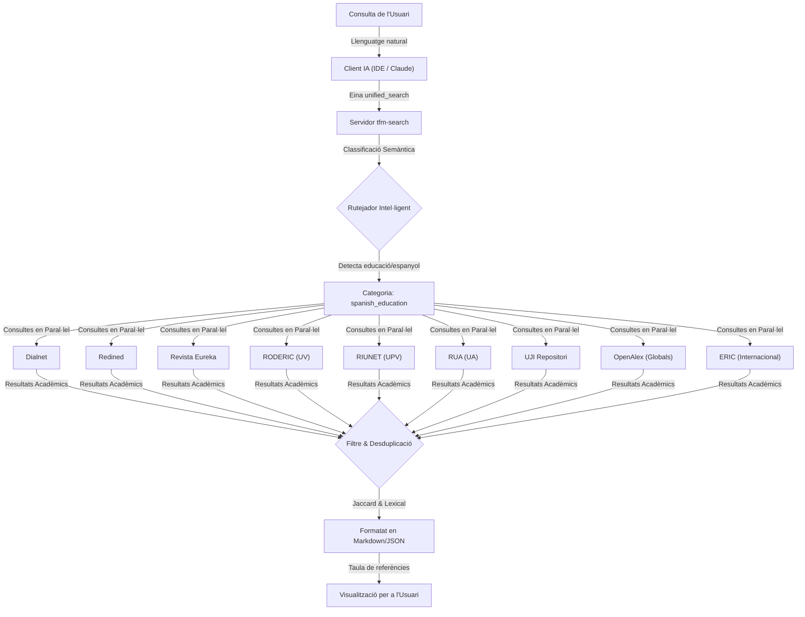

# 🛠️ Metodologia i Transparència: Automatització de la Cerca Bibliogràfica amb `tfm-search`

Aquest document descriu la integració d'intel·ligència artificial i desenvolupament propi en la metodologia de recerca d'aquest TFM. S'exposa de manera transparent com s'ha dissenyat i emprat una eina de programari per optimitzar les tasques documentals.

---

## 📋 Declaració de Transparència i Rigor Metodològic

En l'elaboració d'aquest treball, s'ha aplicat una divisió clara entre les tasques mecàniques de gestió de dades i el intel·lectual propi d'una recerca acadèmica:

*   **El Treball Mecànic (Automatitzat):** La cerca repetitiva en múltiples portals, la introducció manual de paraules clau a 29 motors de cerca diferents, la descàrrega de documents, la filtració de resultats duplicats i la importació manual de fitxers de citació a Zotero. Tota aquesta tasca —que és de caràcter rutinari i no requereix reflexió pedagògica— s'ha automatitzat mitjançant el servidor customitzat **`tfm-search`** (Model Context Protocol). Això garanteix un rigor molt superior en la revisió sistemàtica i evita l'omissió de referències clau.
*   **El Treball Intel·lectual (Exclusivament Humà):** El filtratge crític de la bibliografia obtinguda, la lectura comprensiva dels articles, l'anàlisi pedagògica dels corrents didàctics, la síntesi teòrica de l'estat de l'art, i la redacció intel·lectual de la memòria, així com el disseny original de la unitat didàctica de Física i Química per a secundària.

Aquest exercici de disseny de programari és, a la vegada, un **exemple pràctic del Pensament Computacional** que es defensa en aquest TFM: davant un problema real de recerca (cerca d'informació fragmentada), s'ha realitzat una descomposició del problema, dissenyat un algorisme de cerca i desduplicació, i s'ha automatitzat la solució.

---

## 💬 1. Exemple de Consulta en Llenguatge Natural

En lloc de realitzar cerques individuals a cadascuna de les 29 plataformes, l'usuari interacciona en llenguatge natural amb l'assistent de IA integrat a l'IDE:

> **"Busca articles de didàctica en espanyol sobre com ensenyar química o física de secundària emprant programació o pensament computacional."**

---

## ⚙️ 2. Execució i Ruteig del Servidor MCP

La IA tradueix la intenció i fa la crida a l'eina **`unified_search`** del servidor local. El flux de treball s'executa automàticament en paral·lel:

### Detall dels passos interns:
1. **Classificació de Categoria:** En detectar conceptes com *"secundària"*, *"didàctica"* o *"espanyol"*, el rutejador classifica la cerca com a `spanish_education` i selecciona automàticament les 9 fonts corresponents.
2. **Cerca Paral·lela:** Es llança una consulta asíncrona a les bases de dades generals i als repositoris institucionals valencians.
3. **Desduplicació:** Si un mateix article es troba indexat alhora a *Dialnet*, *OpenAlex* i *RODERIC*, el sistema calcula la distància de Jacc## 📊 3. Resultats Retornats a l'IDE (Exemple Real d'Alta Potència)

El servidor MCP unifica les respostes de les bases de dades locals i internacionals, descartant duplicats i aplicant un rànquing de rellevància basat en la qualitat de la font i el nombre de citacions. La IA rep i mostra a l'IDE una taula com la següent:

### 🔬 Resultats de Cerca Acadèmica (`tfm-search`)
**Consulta:** *"Busca articles de didàctica en espanyol sobre com ensenyar química o física de secundària emprant programació o pensament computacional."* | **Categoria:** `spanish_education`

| # | Puntuació | Títol de l'Article | Autors | Font (Pes) | Any | Cit. | Accés / DOI |
|---|---|---|---|---|---|---|---|
| 1 | **78.00** | [Programación didáctica de Física y Química 3º ESO](https://ebuah.uah.es/dspace/handle/10017/63540) | Jaime Tostado Sánchez | OpenAlex (8) / UAH | 2024 | 0 | 🔓 [PDF](https://ebuah.uah.es/dspace/bitstream/10017/63540/1/TFM_Tostado_Sanchez_2024.pdf) |
| 2 | **73.09** | [El debate sobre el pensamiento computacional en educación](https://doi.org/10.5944/ried.22.1.22303) | J. Adell Segura, M. Á. Llopis Nebot, F. M. Esteve-Mon & M. G. Valdeolivas Novella | OpenAlex (8) / RIED | 2019 | 77 | 🔓 [PDF](http://revistas.uned.es/index.php/ried/article/download/22303/18673) / 🔗 [DOI](https://doi.org/10.5944/ried.22.1.22303) |
| 3 | **67.46** | [Análisis observacional del desarrollo del pensamiento computacional en Educación Infantil-3 años...](https://doi.org/10.6018/red.480411) | M. Terroba, J. M. Ribera Puchades, D. Lapresa & M. T. Anguera | OpenAlex (8) / RED | 2021 | 8 | 🔓 [PDF](https://revistas.um.es/red/article/download/480411/313691) / 🔗 [DOI](https://doi.org/10.6018/red.480411) |
| 4 | **61.67** | [A Systematic Review of Computational Thinking in Science Classrooms](https://eric.ed.gov/?id=EJ1365633) | A. A. Ogegbo & U. Ramnarain | ERIC (9) | 2022 | 0 | 🔗 [ERIC](https://eric.ed.gov/?id=EJ1365633) |
| 5 | **54.12** | [El pensamiento algorítmico como estrategia didáctica para el desarrollo de habilidades de resolución de problemas en el contexto de la educación básica secundaria](https://doi.org/10.6018/red.542111) | D. F. Pinzón Pérez, M. Román-González & E. V. González Palacio | OpenAlex (8) / RED | 2023 | 8 | 🔓 [PDF](https://revistas.um.es/red/article/download/542111/336771) / 🔗 [DOI](https://doi.org/10.6018/red.542111) |
| 6 | **45.00** | [Aplicación del pensamiento computacional en el aula. Una unidad didáctica con alumnado de ESO](https://dialnet.unirioja.es/servlet/articulo?codigo=9259647) | Pablo Antonio Gargallo Jaquotot | Dialnet (8) | 2023 | 0 | 🔗 [Dialnet](https://dialnet.unirioja.es/servlet/articulo?codigo=9259647) |
| 7 | **45.00** | [Creatividad y pensamiento computacional. Una secuencia didáctica para explorar su intersección dentro del marco STEM](https://dialnet.unirioja.es/servlet/articulo?codigo=10281230) | I. Pont Niclòs, E. Izquierdo Sanchis & Y. Echegoyen Sanz | Dialnet (8) | 2023 | 0 | 🔗 [Dialnet](https://dialnet.unirioja.es/servlet/articulo?codigo=10281230) |
| 8 | **43.56** | [El uso de imágenes en textos de física para la enseñanza secundaria y universitaria](http://hdl.handle.net/10183/141206) | M. R. Otero, M. A. Moreira & I. M. Greca | OpenAlex (8) | 2016 | 13 | 🔓 [PDF](http://hdl.handle.net/10183/141206) |
| 9 | **40.32** | [Desafíos del profesor de ciencias frente a estudiantes Millennials y Post-Millennials](https://doi.org/10.21703/0718-5162.v20.n43.2021.017) | M. E. Godoy, E. Zúñiga Garay & M. T. Niksic | OpenAlex (8) | 2021 | 7 | 🔓 [PDF](https://revistas.ucsc.cl/index.php/rexe/article/download/916/766/3440) / 🔗 [DOI](https://doi.org/10.21703/0718-5162.v20.n43.2021.017) |
| 10 | **40.00** | [El pensamiento crítico desde un aula STEAM. Una controversia patrimonial a través del pensamiento computacional, indagación y modelización](https://dialnet.unirioja.es/servlet/tesis?codigo=397879) | Alejandro Campina López | Dialnet (8) | 2023 | 0 | 🔗 [Dialnet](https://dialnet.unirioja.es/servlet/tesis?codigo=397879) |

*Nota: La puntuació final reflecteix la concurrència lexicogràfica combinada amb el pes específic de la indexació de la revista (com Dialnet, ERIC o segells de qualitat FECYT).*

---

## 🏛️ 4. Cerca Especialitzada: Obres Fundacionals i Històriques (Papert vs. Wing)

La potència del servidor MCP també es reflecteix en la capacitat de recuperar debats teòrics profunds i genealogies conceptuals. Quan es consulta sobre els orígens epistemològics (com la transició del construccionisme de Papert al pensament computacional de Wing), l'MCP realitza una cerca creuada i extreu els articles clau de referència mundial:

### 🔬 Resultats de Cerca Acadèmica (`tfm-search`)
**Consulta:** *"computational thinking Jeannette Wing Seymour Papert"* | **Categoria:** `education`

| # | Puntuació | Títol de l'Article | Autors | Font (Pes) | Any | Cit. | Accés / DOI |
|---|---|---|---|---|---|---|---|
| 1 | **82.00** | [Computational Thinking, Between Papert and Wing](https://doi.org/10.1007/s11191-021-00202-5) | Michael Lodi & Simone Martini | OpenAlex (8) / Springer | 2021 | 190 | 🔓 [PDF](https://link.springer.com/content/pdf/10.1007/s11191-021-00202-5.pdf) / 🔗 [DOI](https://doi.org/10.1007/s11191-021-00202-5) |
| 2 | **65.10** | [The Impact of Coding Apps to Support Young Children in Computational Thinking and Computational Fluency. A Literature Review](https://doi.org/10.3389/feduc.2021.657895) | Stamatis Papadakis | OpenAlex (8) / Frontiers | 2021 | 139 | 🔓 [PDF](https://www.frontiersin.org/articles/10.3389/feduc.2021.657895/pdf) / 🔗 [DOI](https://doi.org/10.3389/feduc.2021.657895) |
| 3 | **60.50** | [Computational Thinking: The Developing Definition](https://eprints.soton.ac.uk/346937/) | Cynthia Selby | OpenAlex (8) / Southampton | 2013 | 368 | 🔓 [PDF](https://eprints.soton.ac.uk/346937/1/Selby_an_for_eprints.pdf) |
| 4 | **60.33** | [Computational thinking - a guide for teachers](https://eprints.soton.ac.uk/424545/) | Andrew Csizmadia et al. | OpenAlex (8) / CAS | 2015 | 229 | 🔓 [PDF](https://eprints.soton.ac.uk/424545/1/150818_Computational_Thinking_1_.pdf) |
| 5 | **58.79** | [Remixing as a Pathway to Computational Thinking](https://doi.org/10.1145/2818048.2819984) | S. Dasgupta, M. Resnick et al. | OpenAlex (8) / ACM | 2016 | 100 | 🔓 [PDF](http://dl.acm.org/ft_gateway.cfm?id=2819984&type=pdf) / 🔗 [DOI](https://doi.org/10.1145/2818048.2819984) |

Això permet a l'investigador reconstruir l'evolució teòrica del PC de manera precisa, enllaçant des de la construcció primerenca de programes (Papert) fins a la integració d'abstraccions complexes (Wing).

---

## 💡 5. Integració amb altres Eines del TFM

Una vegada filtrada la taula i escollits els articles més rellevants, el procés documental s'enllaça amb la resta de l'ecosistema local:
* **Ingesta automàtica a Zotero:** Executant la instrucció `mcp_zotero_zotero_add_by_doi(doi="10.5944/ried.22.1.22303")` des del terminal, l'article es registra instantàniament en la col·lecció del gestor bibliogràfic amb totes les seves metadades (any, autors, abstract, pàgines).
* **Descàrrega intel·ligent amb bypass VPN:** Si es vol descarregar el PDF d'accés tancat (o de subscripció institucional), l'MCP connecta autònomament la VPN de la Universitat de València (`eduVPN` UV), realitza el túnel segur, descarrega el fitxer de la revista i el guarda a la carpeta de descàrregues de la recerca.
