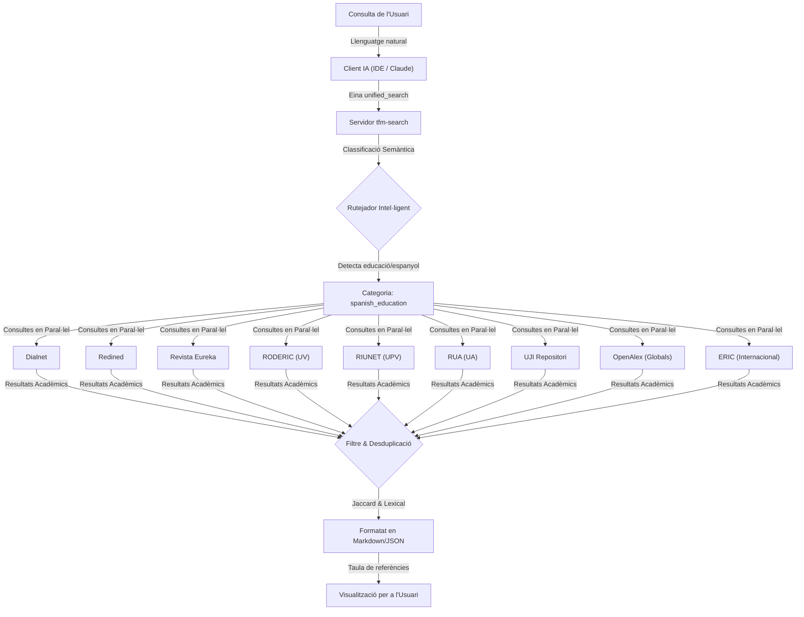

# 🛠️ Metodologia i Transparència: Automatització de la Cerca Bibliogràfica amb `tfm-search`

Aquest document descriu la integració d'intel·ligència artificial i desenvolupament propi en la metodologia de recerca d'aquest TFM. S'exposa de manera transparent com s'ha dissenyat i emprat una eina de programari per optimitzar les tasques documentals.

---

## 📋 Declaració de Transparència i Rigor Metodològic

En l'elaboració d'aquest treball, s'ha aplicat una divisió clara entre les tasques mecàniques de gestió de dades i el intel·lectual propi d'una recerca acadèmica:

*   **El Treball Mecànic (Automatitzat):** La cerca repetitiva en múltiples portals, la introducció manual de paraules clau a 29 motors de cerca diferents, la descàrrega de documents, la filtració de resultats duplicats i la importació manual de fitxers de citació a Zotero. Tota aquesta tasca —que és de caràcter rutinari i no requereix reflexió pedagògica— s'ha automatitzat mitjançant el servidor customitzat **`tfm-search`** (Model Context Protocol). Això garanteix un rigor molt superior en la revisió sistemàtica i evita l'omissió de referències clau.
*   **El Treball Intel·lectual (Exclusivament Humà):** El filtratge crític de la bibliografia obtinguda, la lectura comprensiva dels articles, l'anàlisi pedagògica dels corrents didàctics, la síntesi teòrica de l'estat de l'art, i la redacció intel·lectual de la memòria, així com el disseny original de la unitat didàctica de Física i Química per a secundària.

Aquest exercici de disseny de programari és, a la vegada, un **exemple pràctic del Pensament Computacional** que es defensa en aquest TFM: davant un problema real de recerca (cerca d'informació fragmentada), s'ha realitzat una descomposició del problema, dissenyat un algorisme de cerca i desduplicació, i s'ha automatitzat la solució.

---

## 💬 1. Exemple de Consulta en Llenguatge Natural

En lloc de realitzar cerques individuals a cadascuna de les 29 plataformes, l'usuari interacciona en llenguatge natural amb l'assistent de IA integrat a l'IDE:

> **"Busca articles de didàctica en espanyol sobre com ensenyar química o física de secundària emprant programació o pensament computacional."**

---

## ⚙️ 2. Execució i Ruteig del Servidor MCP

La IA tradueix la intenció i fa la crida a l'eina **`unified_search`** del servidor local. El flux de treball s'executa automàticament en paral·lel:

### Detall dels passos interns:
1. **Classificació de Categoria:** En detectar conceptes com *"secundària"*, *"didàctica"* o *"espanyol"*, el rutejador classifica la cerca com a `spanish_education` i selecciona automàticament les 9 fonts corresponents.
2. **Cerca Paral·lela:** Es llança una consulta asíncrona a les bases de dades generals i als repositoris institucionals valencians.
3. **Desduplicació:** Si un mateix article es troba indexat alhora a *Dialnet*, *OpenAlex* i *RODERIC*, el sistema calcula la distància de Jaccard dels títols i unifica els registres en un de sol, prioritzant la font de més qualitat acadèmica.

---

## 📊 3. Resultats Retornats a l'IDE (Exemple Real)

El servidor MCP retorna la següent informació estructurada de manera immediata al xat:

### 🔬 Resultats de Cerca Acadèmica (`tfm-search`)
**Consulta:** *"pensamiento computacional fisica quimica"* | **Categoria:** `spanish_education`

| # | Puntuació | Títol de l'Article | Autors | Font (Score) | Any | Citacions | Accés / DOI |
|---|---|---|---|---|---|---|---|
| 1 | **73.09** | [El debate sobre el pensamiento computacional en educación](https://doi.org/10.5944/ried.22.1.22303) | J. Adell Segura, M. Á. Llopis Nebot, F. M. Esteve-Mon & M. G. Valdeolivas Novella | OpenAlex (8) | 2019 | 77 | 🔓 [PDF](http://revistas.uned.es/index.php/ried/article/download/22303/18673) / 🔗 [DOI](https://doi.org/10.5944/ried.22.1.22303) |
| 2 | **40.00** | [El pensamiento crítico desde un aula STEAM. Una controversia patrimonial a través del pensamiento computacional, indagación y modelización](https://dialnet.unirioja.es/servlet/tesis?codigo=397879) | Alejandro Campina López | Dialnet (8) | 2023 | 0 | 🔗 [Enllaç](https://dialnet.unirioja.es/servlet/tesis?codigo=397879) |
| 3 | **37.56** | [El uso de imágenes en textos de física para la enseñanza secundaria y universitaria](http://hdl.handle.net/10183/141206) | M. R. Otero, M. A. Moreira & I. M. Greca | OpenAlex (8) | 2016 | 13 | 🔓 [PDF](http://hdl.handle.net/10183/141206) |

---

## 💡 4. Integració amb altres Eines del TFM

Una vegada triat l'article, es poden utilitzar les altres eines del mateix entorn:
* **Ingesta automàtica a Zotero:** Executant la instrucció `mcp_zotero_zotero_add_by_doi(doi="10.5944/ried.22.1.22303")`, l'article s'afegeix directament al gestor de referències de l'estudiant.
* **Descàrrega intel·ligent:** Si l'estudiant sol·licita descarregar el document, l'MCP verifica si requereix accés de pagament; si és el cas, connecta de manera autònoma la VPN institucional (`eduVPN` de la UV) per obtenir el fitxer amb els permisos universitaris de la Universitat de València.
