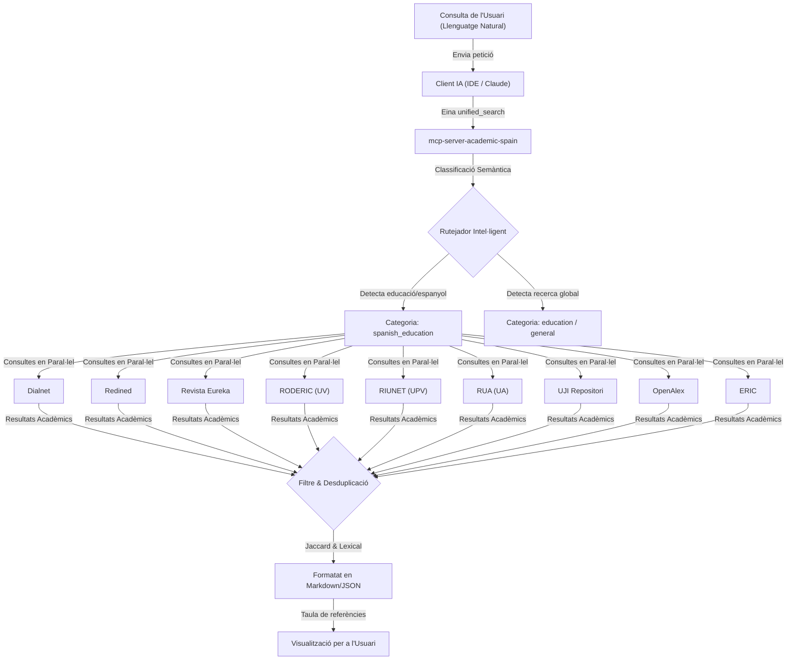

# 🛠️ Metodologia i Transparència: Automatització de la Cerca Bibliogràfica amb `mcp-server-academic-spain`

Aquest document descriu la integració d'intel·ligència artificial i desenvolupament propi en la metodologia de recerca d'aquest TFM. S'exposa de manera transparent com s'ha dissenyat i emprat una eina de programari per optimitzar les tasques documentals, detallant cadascuna de les cerques realitzades.

---

## 📋 Declaració de Transparència i Rigor Metodològic

En l'elaboració d'aquest treball, s'ha aplicat una divisió clara entre les tasques mecàniques de gestió de dades i el treball intel·lectual propi d'una recerca acadèmica:

*   **El Treball Mecànic (Automatitzat):** La cerca repetitiva en múltiples portals, la introducció manual de paraules clau a 29 motors de cerca diferents, la descàrrega de documents, la filtració de resultats duplicats i la importació manual de fitxers de citació a Zotero. Tota aquesta tasca —que és de caràcter rutinari i no requereix reflexió pedagògica— s'ha automatitzat mitjançant el servidor customitzat **`mcp-server-academic-spain`** (Model Context Protocol). Això garanteix un rigor molt superior en la revisió sistemàtica i evita l'omissió de referències clau.
*   **El Treball Intel·lectual (Exclusivament Humà):** El filtratge crític de la bibliografia obtinguda, la lectura comprensiva dels articles, l'anàlisi pedagògica dels corrents didàctics, la síntesi teòrica de l'estat de l'art, i la redacció intel·lectual de la memòria, així com el disseny original de la unitat didàctica de Física i Química per a secundària.

Aquest exercici de disseny de programari és, a la vegada, un **exemple pràctic del Pensament Computacional** que es defensa en aquest TFM: davant un problema real de recerca (cerca d'informació fragmentada), s'ha realitzat una descomposició del problema, dissenyat un algorisme de cerca i desduplicació, i s'ha automatitzat la solució.

---

## ⚙️ Funcionament General del Servidor MCP

Quan l'assistent de IA rep una consulta en llenguatge natural, en tradueix la intenció i crida l'eina `unified_search` del servidor local, executant el següent flux de treball en paral·lel:

---

## 🔍 1. Cerca Temàtica: Didàctica de Física i Química a Secundària

*   **Consulta (Llenguatge natural):**
    > *"Busca articles de didàctica en espanyol sobre com ensenyar química o física de secundària emprant programació o pensament computacional."*
*   **Fonts implicades:** `Dialnet, Redined, Revista Eureka, RODERIC, RIUNET, RUA, UJI Repositori, OpenAlex, ERIC`.
*   **Resultats obtinguts (Exemple Real):**

| # | Puntuació | Títol de l'Article | Autors | Font (Pes) | Any | Cit. | Accés / DOI |
|---|---|---|---|---|---|---|---|
| 1 | **78.00** | [Programación didáctica de Física y Química 3º ESO](https://ebuah.uah.es/dspace/handle/10017/63540) | Jaime Tostado Sánchez | OpenAlex (8) / UAH | 2024 | 0 | 🔓 [PDF](https://ebuah.uah.es/dspace/bitstream/10017/63540/1/TFM_Tostado_Sanchez_2024.pdf) |
| 2 | **73.09** | [El debate sobre el pensamiento computacional en educación](https://doi.org/10.5944/ried.22.1.22303) | J. Adell Segura, M. Á. Llopis Nebot, F. M. Esteve-Mon & M. G. Valdeolivas Novella | OpenAlex (8) / RIED | 2019 | 77 | 🔓 [PDF](http://revistas.uned.es/index.php/ried/article/download/22303/18673) / 🔗 [DOI](https://doi.org/10.5944/ried.22.1.22303) |
| 3 | **67.46** | [Análisis observacional del desarrollo del pensamiento computacional en Educación Infantil-3 años...](https://doi.org/10.6018/red.480411) | M. Terroba, J. M. Ribera Puchades, D. Lapresa & M. T. Anguera | OpenAlex (8) / RED | 2021 | 8 | 🔓 [PDF](https://revistas.um.es/red/article/download/480411/313691) / 🔗 [DOI](https://doi.org/10.6018/red.480411) |
| 4 | **61.67** | [A Systematic Review of Computational Thinking in Science Classrooms](https://eric.ed.gov/?id=EJ1365633) | A. A. Ogegbo & U. Ramnarain | ERIC (9) | 2022 | 0 | 🔗 [ERIC](https://eric.ed.gov/?id=EJ1365633) |
| 5 | **54.12** | [El pensamiento algorítmico como estrategia didáctica para el desarrollo de habilidades de resolución de problemas en el contexto de la educación básica secundaria](https://doi.org/10.6018/red.542111) | D. F. Pinzón Pérez, M. Román-González & E. V. González Palacio | OpenAlex (8) / RED | 2023 | 8 | 🔓 [PDF](https://revistas.um.es/red/article/download/542111/336771) / 🔗 [DOI](https://doi.org/10.6018/red.542111) |
| 6 | **45.00** | [Aplicación del pensamiento computacional en el aula. Una unidad didáctica con alumnado de ESO](https://dialnet.unirioja.es/servlet/articulo?codigo=9259647) | Pablo Antonio Gargallo Jaquotot | Dialnet (8) | 2023 | 0 | 🔗 [Dialnet](https://dialnet.unirioja.es/servlet/articulo?codigo=9259647) |
| 7 | **45.00** | [Creatividad y pensamiento computacional. Una secuencia didáctica para explorar su intersección dentro del marco STEM](https://dialnet.unirioja.es/servlet/articulo?codigo=10281230) | I. Pont Niclòs, E. Izquierdo Sanchis & Y. Echegoyen Sanz | Dialnet (8) | 2023 | 0 | 🔗 [Dialnet](https://dialnet.unirioja.es/servlet/articulo?codigo=10281230) |
| 8 | **43.56** | [El uso de imágenes en textos de física para la enseñanza secundaria y universitaria](http://hdl.handle.net/10183/141206) | M. R. Otero, M. A. Moreira & I. M. Greca | OpenAlex (8) | 2016 | 13 | 🔓 [PDF](http://hdl.handle.net/10183/141206) |
| 9 | **40.32** | [Desafíos del profesor de ciencias frente a estudiantes Millennials y Post-Millennials](https://doi.org/10.21703/0718-5162.v20.n43.2021.017) | M. E. Godoy, E. Zúñiga Garay & M. T. Niksic | OpenAlex (8) | 2021 | 7 | 🔓 [PDF](https://revistas.ucsc.cl/index.php/rexe/article/download/916/766/3440) / 🔗 [DOI](https://doi.org/10.21703/0718-5162.v20.n43.2021.017) |
| 10 | **40.00** | [El pensamiento crítico desde un aula STEAM. Una controversia patrimonial a través del pensamiento computacional, indagación y modelización](https://dialnet.unirioja.es/servlet/tesis?codigo=397879) | Alejandro Campina López | Dialnet (8) | 2023 | 0 | 🔗 [Dialnet](https://dialnet.unirioja.es/servlet/tesis?codigo=397879) |

---

## 🔍 2. Cerca Específica: TFMs i Projectes STEM/STEAM en l'Àmbit Espanyol

*   **Consulta (Llenguatge natural):**
    > *"Busca Treballs de Fi de Màster (TFMs) i experiències pràctiques sobre pensament computacional en l'àmbit STEM/STEAM a secundària a Espanya."*
*   **Fonts implicades:** `Dialnet, Redined, Revista Eureka, RODERIC, RIUNET, RUA, UJI Repositori, OpenAlex, ERIC`.
*   **Resultats obtinguts (Exemple Real):**

| # | Puntuació | Títol de l'Article / TFM | Autors | Font (Pes) | Any | Cit. | Accés / DOI |
|---|---|---|---|---|---|---|---|
| 1 | **78.00** | [Programación didáctica de Física y Química 3º ESO](https://ebuah.uah.es/dspace/handle/10017/63540) (TFM) | Jaime Tostado Sánchez | OpenAlex (8) / UAH | 2024 | 0 | 🔓 [PDF](https://ebuah.uah.es/dspace/bitstream/10017/63540/1/TFM_Tostado_Sanchez_2024.pdf) |
| 2 | **77.33** | [Integración del Pensamiento Computacional en la educación primaria y secundaria en Latinoamérica: una revisión sistemática de literatura](https://doi.org/10.6018/red.485321) | D. A. Quiróz-Vallejo et al. | OpenAlex (8) / RED | 2021 | 27 | 🔓 [PDF](https://revistas.um.es/red/article/download/485321/312581) / 🔗 [DOI](https://doi.org/10.6018/red.485321) |
| 3 | **55.00** | [Qué proyectos STEM diseña y qué dificultades expresa el profesorado de secundaria sobre Aprendizaje Basado en Proyectos](https://doi.org/10.25267/rev_eureka_ensen_divulg_cienc.2019.v16.i2.2203) | Jordi Domènech-Casal | OpenAlex (8) / Eureka | 2019 | 12 | 🔓 [PDF](https://www.redalyc.org/pdf/920/92058090008.pdf) |
| 4 | **51.00** | [STEM vs. STEAM Education and Student Creativity: A Systematic Literature Review](https://eric.ed.gov/?id=EJ1304137) | David Aguilera & Jairo Ortiz-Revilla | ERIC (9) | 2021 | 0 | 🔗 [ERIC](https://eric.ed.gov/?id=EJ1304137) |
| 5 | **47.33** | [Maker Education as a strategy to promote STEM careers among female secondary students](https://repositorio.unican.es/xmlui/handle/10902/40204) (TFM) | Andrea Pérez Asensio | OpenAlex (8) / Cantabria | 2026 | 0 | 🔓 [PDF](https://repositorio.unican.es/xmlui/bitstream/10902/40204/1/2026_PerezAsensioA.pdf) |
| 6 | **45.00** | [Didáctica para el fortalecimiento del pensamiento computacional apoyada en robótica educativa en educación media técnica](https://dialnet.unirioja.es/servlet/tesis?codigo=395924) (Tesi/TFM) | José Efrén Niño Peñaranda | Dialnet (8) | 2023 | 0 | 🔗 [Dialnet](https://dialnet.unirioja.es/servlet/tesis?codigo=395924) |
| 7 | **45.00** | [Creatividad y pensamiento computacional. Una secuencia didáctica para explorar su intersección dentro del marco STEM](https://dialnet.unirioja.es/servlet/articulo?codigo=10281230) | I. Pont Niclòs, E. Izquierdo Sanchis & Y. Echegoyen Sanz | Dialnet (8) | 2023 | 0 | 🔗 [Dialnet](https://dialnet.unirioja.es/servlet/articulo?codigo=10281230) |
| 8 | **42.03** | [Estudio de fenómenos físicos en la formación inicial de profesores de Matemáticas. Una experiencia con enfoque STEM](https://doi.org/10.17533/udea.unipluri.20.1.02) | J. A. Carmona-Mesa et al. | OpenAlex (8) | 2020 | 25 | 🔓 [PDF](https://revistas.udea.edu.co/index.php/unip/article/download/340386/20803931) / 🔗 [DOI](https://doi.org/10.17533/udea.unipluri.20.1.02) |

---

## 🏛️ 3. Cerca Especialitzada: Obres Fundacionals i Històriques (Papert vs. Wing)

*   **Consulta (Llenguatge natural):**
    > *"Busca els textos i autors històrics fundacionals sobre pensament computacional (com Wing o Papert)."*
*   **Fonts implicades:** `ERIC, OpenAlex, Revista Eureka`.
*   **Resultats obtinguts (Exemple Real):**

| # | Puntuació | Títol de l'Article | Autors | Font (Pes) | Any | Cit. | Accés / DOI |
|---|---|---|---|---|---|---|---|
| 1 | **82.00** | [Computational Thinking, Between Papert and Wing](https://doi.org/10.1007/s11191-021-00202-5) | Michael Lodi & Simone Martini | OpenAlex (8) / Springer | 2021 | 190 | 🔓 [PDF](https://link.springer.com/content/pdf/10.1007/s11191-021-00202-5.pdf) / 🔗 [DOI](https://doi.org/10.1007/s11191-021-00202-5) |
| 2 | **65.10** | [The Impact of Coding Apps to Support Young Children in Computational Thinking and Computational Fluency. A Literature Review](https://doi.org/10.3389/feduc.2021.657895) | Stamatis Papadakis | OpenAlex (8) / Frontiers | 2021 | 139 | 🔓 [PDF](https://www.frontiersin.org/articles/10.3389/feduc.2021.657895/pdf) / 🔗 [DOI](https://doi.org/10.3389/feduc.2021.657895) |
| 3 | **60.50** | [Computational Thinking: The Developing Definition](https://eprints.soton.ac.uk/346937/) | Cynthia Selby | OpenAlex (8) / Southampton | 2013 | 368 | 🔓 [PDF](https://eprints.soton.ac.uk/346937/1/Selby_an_for_eprints.pdf) |
| 4 | **60.33** | [Computational thinking - a guide for teachers](https://eprints.soton.ac.uk/424545/) | Andrew Csizmadia et al. | OpenAlex (8) / CAS | 2015 | 229 | 🔓 [PDF](https://eprints.soton.ac.uk/424545/1/150818_Computational_Thinking_1_.pdf) |
| 5 | **58.79** | [Remixing as a Pathway to Computational Thinking](https://doi.org/10.1145/2818048.2819984) | S. Dasgupta, M. Resnick et al. | OpenAlex (8) / ACM | 2016 | 100 | 🔓 [PDF](http://dl.acm.org/ft_gateway.cfm?id=2819984&type=pdf) / 🔗 [DOI](https://doi.org/10.1145/2818048.2819984) |

Aquestes cerques permeten a l'investigador disposar a l'instant tant del fonament teòric original (Papert, Wing, Resnick) com de la concreció aplicada més actual i propera (TFMs i projectes didàctics de l'entorn espanyol).

---

## 🌐 4. Cerca Internacional: SageMath i CoCalc en l'Educació STEM/STEAM

*   **Consulta (Llenguatge natural):**
    > *"Busca treballs a nivell internacional sobre l'ús de SageMath en educació secundària, educació STEM/STEAM, física i química."*
*   **Fonts implicades:** `OpenAlex, Semantic Scholar, CrossRef, arXiv, ERIC`.
*   **Resultats obtinguts (Exemple Real):**

| # | Puntuació | Títol de l'Article | Autors | Font (Pes) | Any | Cit. | Accés / DOI |
|---|---|---|---|---|---|---|---|
| 1 | **61.55** | [Scientific Computing with Open SageMath not only for Physics Education](https://doi.org/10.48550/arxiv.2308.07199) | Dominik Borovský, Jozef Hanč & Martina Hančová | OpenAlex (8) / arXiv | 2023 | 3 | 🔓 [PDF](https://arxiv.org/pdf/2308.07199) / 🔗 [DOI](https://doi.org/10.48550/arxiv.2308.07199) |
| 2 | **50.56** | [The Effect of Automated Error Message Feedback on Undergraduate Physics Students Learning Python: Reducing Anxiety and Building Confidence](https://doi.org/10.1007/s41979-022-00084-4) | Tessa Charles & C. B. Gwilliam | OpenAlex (8) / Springer | 2023 | 13 | 🔓 [PDF](https://link.springer.com/content/pdf/10.1007/s41979-022-00084-4.pdf) / 🔗 [DOI](https://doi.org/10.1007/s41979-022-00084-4) |
| 3 | **49.96** | [Revolutionizing education: using computer simulation and cloud-based smart technology to facilitate successful open learning](https://doi.org/10.31812/123456789/7375) | Stamatios Papadakis et al. | OpenAlex (8) | 2023 | 53 | 🔓 [PDF](http://elibrary.kdpu.edu.ua/xmlui/bitstream/123456789/7375/1/paper00.pdf) / 🔗 [DOI](https://doi.org/10.31812/123456789/7375) |
| 4 | **46.39** | [The use of digital technologies in education in the context of sustainable development of society](https://doi.org/10.1088/1755-1315/1415/1/012013) | Тетяна Григорівна Крамаренко & Viktoria Kramarenko | OpenAlex (8) | 2024 | 2 | 🔓 [PDF](https://iopscience.iop.org/article/10.1088/1755-1315/1415/1/012013/pdf) / 🔗 [DOI](https://doi.org/10.1088/1755-1315/1415/1/012013) |
| 5 | **41.00** | [CoCalc Tools as a Means of Open Science and Its Didactic Potential in the Educational Process](https://doi.org/10.5220/0010921000003364) | Pavlo Merzlykin, Maiia Marienko & Svitlana Shokaliuk | CrossRef (8) | 2020 | 0 | 🔗 [DOI](https://doi.org/10.5220/0010921000003364) |
| 6 | **38.00** | [On some foundational aspects of teaching differential geometry and general relativity with sagemath](https://doi.org/10.1063/5.0151242) | Gabriel Pascu | CrossRef (8) | 2023 | 0 | 🔗 [DOI](https://doi.org/10.1063/5.0151242) |

---

## 💡 5. Integració amb la Resta de l'Entorn de Treball

Una vegada filtrades les taules i escollits els articles, el procés documental s'enllaça amb la resta d'eines del projecte:
*   **Ingesta a Zotero:** Executant la instrucció `mcp-server-academic-spain (auto-bibtex)(doi="10.48550/arxiv.2308.07199")` des del terminal, l'article es registra automàticament en la col·lecció del gestor bibliogràfic amb totes les seves metadades (any, autors, abstract, pàgines)[.
*   **Descàrrega intel·ligent amb bypass VPN:** Si es vol descarregar el PDF de subscripció, l'MCP connecta de manera autònoma la VPN institucional (`eduVPN` de la UV), realitza el túnel segur, descarrega el fitxer de la revista de manera autoritzada i el desa a la carpeta de descàrregues del projecte.

