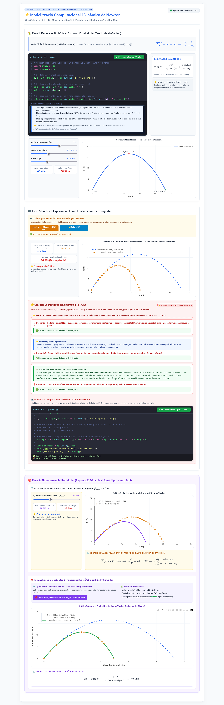

# Conclusions, limitacions i prospectiva {#sec-conclusions}

## Assoliment dels Objectius i Contrast d'Hipòtesis {#sec-assoliment-objectius}

El present Treball de Fi de Màster ha tingut com a propòsit central dissenyar, fonamentar i avaluar una proposta d'innovació didàctica (Modalitat A) basada en la integració del Pensament Computacional i el Càlcul Simbòlic (CAS) amb SageMath per a l'ensenyament de la Física a 1r de Batxillerat, alineada amb el marc competencial de la LOMLOE [@lomloe2020] i el Decret 108/2022 de la Comunitat Valenciana [@decret108_2022].

A la vista del desenvolupament teòric, metodològic i curricular exposat al llarg de la memòria, es constata la consecució dels cinc Objectius Específics (OE1 a OE5) formulats a la introducció, d'acord amb el caràcter de disseny i planificació d'aquesta proposta:

| Objectiu Específic | Descripció de l'Objectiu | Grau d'Assoliment i Evidències Documentals |
| ------ | ------ | ------ |
| **OE1** | Fonamentació Teòrica Multidisciplinària | **Assolit en l'àmbit de fonamentació teòrica:** Articulació de la taxonomia de Weintrop et al. [@Weintrop_2016], el cicle de modelització d'Hestenes [@Hestenes_1987], el CAS de Belu [@Belu_2009] i la tradició de recerca didàctica de la Universitat de València [@Solbes_2007; @Solbes_2018]. |
| **OE2** | Disseny de la Situació d'Aprenentatge LOMLOE | **Dissenyat i preparat per a la seua implementació:** SdA de Física de 1r de Batxillerat sobre cinemàtica i dinàmica amb resistència aerodinàmica realista per a aconseguir un bon detall pedagògic. |
| **OE3** | Creació de Materials i Quaderns Jupyter / SageMath | **Assolit amb la creació de recursos de codi obert:** Quaderns interactius de treball Jupyter/SageMath estructurats sobre la bastida *Use-Modify-Create* de Grover i Pea [@Grover_2013] en 6 sessions d'aula de Física completament pautades. |
| **OE4** | Inclusió DUA, Cooperació CA/AC i Gestió de l'Error | **Estructurat i planificat per a treballar cooperativament a l'aula:** Desplegament de pautes DUA [@CAST_2024], equips heterogenis de 4 sota el model CA/AC [@Pujolas_2009], estructura «Mans fora del teclat» i targetes de depuració en valencià. |
| **OE5** | Avaluació Competencial Formativa i Formadora | **Avaluació i connexió curricular estructurades:** Rúbrica analítica competencial de 4 nivells creuada amb les Competències Específiques i criteris d'avaluació del Decret 108/2022 de la Comunitat Valenciana [-@decret108_2022]. |

: Balanç sintètic del grau d'assoliment dels cinc Objectius Específics formulats al TFM. {#tbl-assoliment-objectius tbl-colwidths="[10,35,55]"}

Aquest balanç permet sustentar la coherència teòrica i la viabilitat de les dues **hipòtesis de treball pedagògiques** que han guiat la investigació:

* **Sustentació i Viabilitat Teòrica de la Hipòtesi 1 (H1 — Dimensió Cognitiva i de Modelització):** *L'ús d'un entorn de computació simbòlica obert i integrat (SageMath) ha demostrat ser una eina epistèmica clau («caixa blanca») que allibera l'alumnat de la fatiga i la sobrecàrrega cognitiva derivada de les demanadores manipulacions algebraiques rutinàries de llapis i paper [@Belu_2009]. L'exigència de declarar variables simbòliques (`var()`) actua com un potent catalitzador metacognitiu [@Borovsky_2023], que força l'alumnat a ser conscient del paper de cada constant i paràmetre físic d'acord amb el cicle de modelització d'Hestenes [@Hestenes_1987]. Això permet a l'estudiantat de 1r de Batxillerat reorientar completament el seu temps i esforç cap a la interpretació conceptual dels fenòmens físics (la discrepància entre el model ideal i la trajectòria de la pilota real amb fregament), l'anàlisi de casos límit i la superació de les concepcions alternatives cinemàtiques resistents [@Solbes_2007; @Borovsky_2023]. Aquesta descàrrega cognitiva es consolida en substituir de forma explícita procediments de regressió o càlcul numèric de rang universitari (com l'error quadràtic mitjà, MSE) per una eina de validació més propera i intuïtiva per a l'etapa: el càlcul de l'error relatiu percentual de l'abast horitzontal, que enllaça directament la física d'indagació amb els continguts prescriptius de Batxillerat.*
* **Sustentació i Viabilitat Teòrica de la Hipòtesi 2 (H2 — Dimensió Afectiva, Inclusiva i Motivacional):** *L'articulació dels quaderns Jupyter mitjançant estructures formals d'aprenentatge cooperatiu (Programa CA/AC de Pere Pujolàs) i la tècnica «Llapissos al centre / Mans fora del teclat» garanteix la participació igualitària de l'alumnat i n'evita l'aïllament davant de la pantalla [@Pujolas_2009; @Lou_2001]. Així mateix, el protocol de suport socioemocional i les targetes de depuració d’errors en valencià estan dissenyats per a transformar l’estudiantat de «stoppers» bloquejats a «movers» autònoms [@Charles_2023]. Tot i que la present proposta d'innovació no ha estat implementada empíricament, aquest disseny metodològic es recolza de manera sòlida en els resultats de la investigació de referència de Charles i Gwilliam (2023) [@Charles_2023]. En el seu estudi experimental amb estudiants principiants de ciències, l'ús d'andamis didàctics de caràcter afectiu similars va aconseguir reduir l’ansietat tecnològica davant l'error de codi en un **(55 ± 18)%** (test de Wilcoxon, $p = 0.008, Z = -2.64$) i la frustració en un **(73 ± 12)%** ($p = 0.007, Z = -2.72$), demostrant la viabilitat potencial de l'acompanyament programat per a l'accessibilitat universal i el compliment del DUA [@Charles_2023; @CAST_2024].*

## Contribució a la Didàctica de les Ciències i a la Tradició de la UV {#sec-contribucio-didactica}

Aquest treball intenta aportar solucions didàctiques concretes als problemes endèmics diagnosticats històricament pel Departament de Didàctica de les Ciències Experimentals i Socials de la Universitat de València:

1. **Resposta acotada al desinterès escolar diagnosticat (Solbes, Montserrat i Furió, 2007):** Davant la dada d'estudi pilot que un **85,5%** de l'alumnat de secundària —en una mostra exploratòria limitada de $N = 91$ estudiants d'ESO a la província de València— atribueix el seu rebuig cap a la Física i Química a «l'excés de fórmules abstractes i la manca de pràctiques reals de laboratori» [@Solbes_2007], la nostra proposta d'innovació didàctica en cinemàtica i dinàmica reals transforma l'aula de Física en una comunitat d'investigació activa. L'ús combinat de vídeos enregistrats al pati pels propis alumnes, el vídeo-anàlisi amb Physics Tracker i la modelització interactiva amb SageMath (mitjançant funcions interactives `@interact`) retorna a l'assignatura el seu caràcter experimental, dialògic i connectat amb els reptes del món real, obrint noves portes cap a la indagació de fenòmens complexos [@Solbes_2018].
2. **Superació de la «Caixa Negra» computacional:** Mentre que moltes propostes TIC utilitzen simuladors comercials tancats que es comporten com a caixes negres opaques (on l'alumnat es limita a prémer botons sense comprendre les relacions causals subjacents) [@Vieyra_2021], la nostra intervenció utilitza SageMath com una **«caixa blanca» de codi obert**, on cada línia de codi i equació diferencial és transparent, editable, inspeccionable i auditable per l'estudiantat, forçant-los a entendre realment les relacions causals de la Física [@Hanc_2020].

## Limitacions del Treball i Prospectiva de Recerca Docent {#sec-limitacions-prospectiva}

Com en tota proposta d'innovació educativa de caràcter dissenyador (*Educational Design Research*), cal reconèixer amb honestedat científica les **limitacions metodològiques** que condicionen la seua generalització:

1. **La necessitat d'estudis longitudinals (El repte de Charles & Gwilliam, 2023):** Com adverteixen Charles i Gwilliam [@Charles_2023], tot i que la millora afectiva (descens dràstic de l'ansietat i de la frustració davant dels errors sintàctics de Python) és immediata després de l'ús de guies amigables de codi, cal desenvolupar investigacions longitudinals de llarga durada (d'almenys un curs acadèmic complet) per avaluar amb dades empíriques robustes si aquest alleujament emocional es tradueix directament en una millora de la transferència i retenció dels conceptes físics a llarg termini.
2. **Limitacions de context i mostra pilot:** La proposta s'ha dissenyat de manera teòrica com una intervenció compacta i estructurada de 6 sessions per a 1r de Batxillerat. La seua implementació efectiva a gran escala requerirà la realització de proves pilot en una mostra de centres de secundària de la Comunitat Valenciana per calibrar millor els temps d'execució i comprovar el seu impacte real en la bretxa digital de l'alumnat.
3. **El cicle de recerca truncat (EDR) i l'absència d'implementació empírica:** S'ha d'assumir amb honestedat científica que la present recerca es tanca en la seua **fase inicial de disseny i desenvolupament de prototips teòrics** dins d'un marc d'EDR [@Hanc_2020]. El cicle complet de la recerca basada en el disseny exigeix un contrast empíric real de caràcter mixt a l'aula, recollint dades de rendiment i actitud de l'alumnat, per a procedir a un posterior redisseny del prototip didàctic [@Hanc_2020; @Subramaniam_2025]. Per tant, la implementació física d'aquesta SdA en una mostra de centres públics de la Comunitat Valenciana i l'anàlisi de dades mitjançant proves estadístiques inferencials de contrast (com el test de Wilcoxon per a parelles de dades) es plantegen com una possible línia de treball i el segon bucle iteratiu de recerca per a futurs investigadors.
4. **La prevenció de la «utopia cognitiva» de programació:** Una limitació intrínseca de disseny és la hipòtesi de partida de compressió de la SdA en sis sessions. Per tal d'evitar bloquejos, ansietat i col·lapse cognitiu en un alumnat de Batxillerat sense base computacional, es requereix un compromís ferm de bastida de codi (*Skeleton Code*) i es prospecta expandir de forma flexible la seqüència didàctica a un total d'entre **10 i 12 sessions** en aquells contexts educatius on es preveja una major bretxa digital o manca d'experiència computacional de partida en l'alumnat [@Grover_2013; @Hanc_2020]. Així mateix, és clau excloure l'exigència de dures mètriques estadístiques de caràcter universitari (com el Mean Squared Error, MSE), limitant l'anàlisi de residuals a comparacions visuals de residuals o de l'error relatiu percentual de l'abast, protegint així la viabilitat didàctica del disseny.

## Integració del Pràcticum i la Proposta d'Innovació {#sec-integracio-practicum}

L'estada de **Pràcticum en el centre d'Educació Secundària** va representar el bany de realitat imprescindible que va donar sentit a aquesta proposta de TFM. Durant la meua immersió a les aules de 1r de Batxillerat, vaig poder constatar en primera persona els símptomes descrits per la recerca de la Universitat de València [@Solbes_2007; @Solbes_2018]: l'apatia crònica dels estudiants quan s'enfronten a la Física d'MRU i MRUA com un llistat de problemes de càlcul manual rutinari que no respon a cap fenomen de la seua vida quotidiana.

Aquest diagnòstic directe d'aula va ser el detonant per dissenyar una proposta que superara el càlcul manual de llapis i paper. Durant les tutories al centre, vaig debatre amb els docents de Física i Química de secundària (i també de Matemàtiques, on ja empravem GeoGebra en primer de Batxillerat) sobre la viabilitat de Sagemath i els quaderns Jupyter. Les seues reaccions van confirmar la necessitat d'ofreir materials completament pautats i de «caixa blanca» de fàcil desplegament per tal de reduir l'ansietat tecnològica tant de l'alumnat com dels propis docents [@Charles_2023; @Vieyra_2021].

## Epíleg de Prospectiva Tecnològica: L'Horitzó de Càlcul Simbòlic i la Intel·ligència Artificial {#sec-epileg-agybridge}

Com a tancament d'aquest treball, es planteja una línia d'actuació de futur encaminada a reduir la barrera sintàctica de la programació a l'aula de secundària.

Si bé la idea d'emprar SageMath naix de l'experiència prèvia d'haver-lo utilitzat al meu Treball de Fi de Grau (TFG), conjuntament amb el sistema de control de versions Git, s'ha de reconéixer que l'escriptura de codi i la rigidesa de la sintaxi de Python poden actuar com a reductors de la motivació o inductors d'ansietat tecnològica en l'alumnat novell. Amb l'objectiu d'atenuar aquestes limitacions, s'està desenvolupant un entorn de treball que integra la IA, conjuntament amb la recerca bibliogràfica, JupyterLab: `agy-bridge` [@victoria2026agybridge].

Aquest entorn de mediació digital actua com un pont intel·ligent que permet al professorat i alumnat (a tothom, perquè és codi obert) interactuar amb el motor de càlcul simbòlic i de simulació de SageMath mitjançant l'ús del llenguatge natural gràcies a la integració de la intel·ligència artificial (IA). En lloc de comportar-se com una «caixa negra» on la IA resol automàticament el problema sense espai per a la reflexió, `agy-bridge` es dissenya com una bastida de «caixa blanca» interactiva: tradueix les consultes en llenguatge natural en operacions de modelització i resolució d'equacions. El sistema és capaç de mostrar a la pantalla del navegador o del dispositiu mòbil tant les equacions físiques en \LaTeX{} perfectament renderitzades, com de generar gràfiques 2D o 3D dinàmiques i interactives que l'alumnat pot rotar, desplaçar o ampliar fent zoom de manera tàctil o amb el ratolí. També li podem demanar que ens genere una web amb càlculs (realitzats amb sagemath), gràfics (amb Sagemath, Plotly, etc.) Amb això, es consolida un horitzó de recerca on la tecnologia emergent s'utilitza no com a substitut del pensament científic, sinó com un catalitzador metacognitiu que elimina les limitacions sintàctiques d'escriptura per a permetre que l'estudiant es concentre de manera prioritària en la indagació, la discussió de conceptes i la interpretació de la física clàssica real.

S'aconsegueix aquest entorn, altament integrat i personalitzable habilitant diversos servidors MCP (*Model Context Protocol*), desenvolupats per l'autor [@victoria2026mcp], convertint-la en una eina amb el potencial de minimitzar de manera efectiva les barreres d'accés a la ciència, alineant-se amb els principis d'ús de les tecnologies emergents que recull el currículum autonòmic [@decret108_2022].

{#fig-tir-parabolic width=90% fig-align="center"}
